출처
- [[따라學IT] 01. 네트워크란 무엇인가?](https://www.youtube.com/watch?v=Av9UFzl_wis&list=PL0d8NnikouEWcF1jJueLdjRIC4HsUlULi)
- [[따라學IT] 01. 네트워크란 무엇인가? - 실습1(tracert)](https://www.youtube.com/watch?v=paJf7JbBWqY&list=PL0d8NnikouEWcF1jJueLdjRIC4HsUlULi&index=2)
- [[따라學IT] 01. 네트워크란 무엇인가? - 실습2(Wireshark)](https://www.youtube.com/watch?v=vBrQ3yzerMg&list=PL0d8NnikouEWcF1jJueLdjRIC4HsUlULi&index=3)

  

# 네트워크란?

- 데이터를 주고 받을 때 사용하는 것이 **프로토콜**

## 네트워크란 무엇인가?
### 네트워크란?
**노드**(네트워크에 속한 컴퓨터 또는 통신 장비)들이 데이터를 공유할 수 있게 하는 디지털 전기**통신망**의 하나. 즉, 분산되어 있는 컴퓨터를 통신망으로 연결한 것. 네트워크에서 여러 장치들은 노드 간 연결을 사용하여 서로에게 데이터를 교환.

### 인터넷이란?
문서, 그림 영상과 같은 여러가지 데이터를 **공유**하도록 구성된 세상에서 가장 큰 전세계를 연결하는 **네트워크**. 흔히 www를 인터넷으로 착각하는 경우가 많은데 www는 인터넷을 통해 웹과 관련된 데이터를 공유하는 것.

- 네트워크가 더 큰 개념. 네트워크 안에 인터넷이 포함.
- 네트워크는 통신망. 인터넷은 여러 개의 통신망 중에서 가장 큰 네트워크 통신망.

## 네트워크의 분류
### 크기에 따른 분류
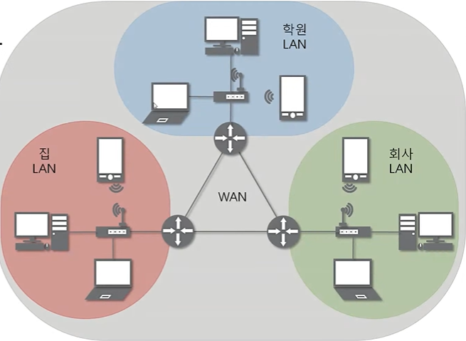

: LAN과 WAN만 알면 됨.

- **LAN(Local Area Network)** : 가까운 지역을 하나로 묶은 네트워크(가까운 지역끼리만. `근거리 통신망`) 
  → ex : 스타크래프트. 근거리통신망 - 같은 PC방에서 게임 가능, 각자 집에서 불가능 
  → 어떤 장비에 연결되어있나. 강의실의 경우, 하나의 LAN 네트워크.
- **WAN(Wide Area Network)** : 멀리 있는 지역을 한데 묶은 네트워크. 가까운 지역끼리 묶인 LAN과 LAN을 다시 하나로 묶은 것(여러 개의 LAN 네트워크 대역을 서로 연결. 멀리 떨어진 것끼리)
- MAN(Metropolitan Area Network)
- 기타(VLAN, CAN, PAN 등)

### 연결 형태에 따른 분류
: Star형과 Mesh형만 기억하면 됨. 

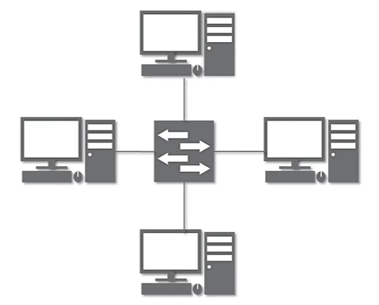
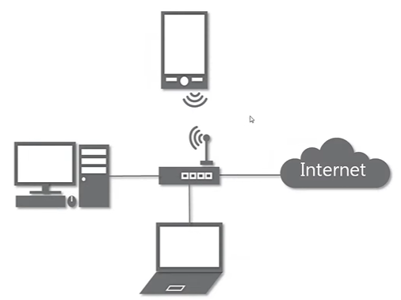
- **Star형** : 중앙 장비에 모든 노드가 연결
  - 강의실, 집 공유기 등이 해당됨. 하나의 장비에 연결.
  - LAN 대역의 네트워크들을 연결시킬 때 Star형으로 많이 연결시킴. (하나의 LAN 대역을 만들 때 Star형으로 많이 만듦.)
  - 문제점 : 중앙 장비가 고장나면 네트워크 통신이 안 됨.

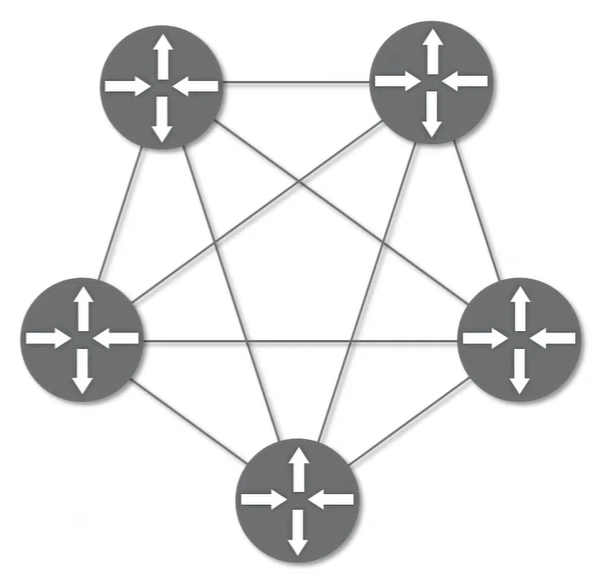
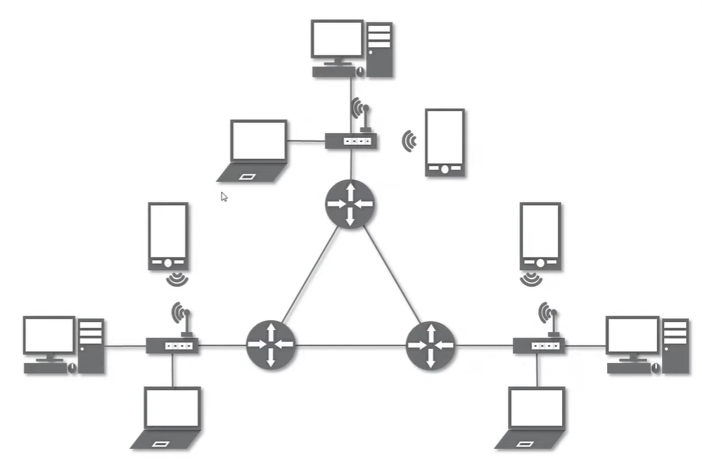
- **Mesh형** : 여러 노드들이 서로 그물처럼 연결
  - 고장이 나도 다른 곳(있을 경우)을 통해 연결 가능
- Tree형 : 마치 나무의 가지처럼 계층 구조로 연결
- 기타 : 링형, 버스형, 혼합형 등

 

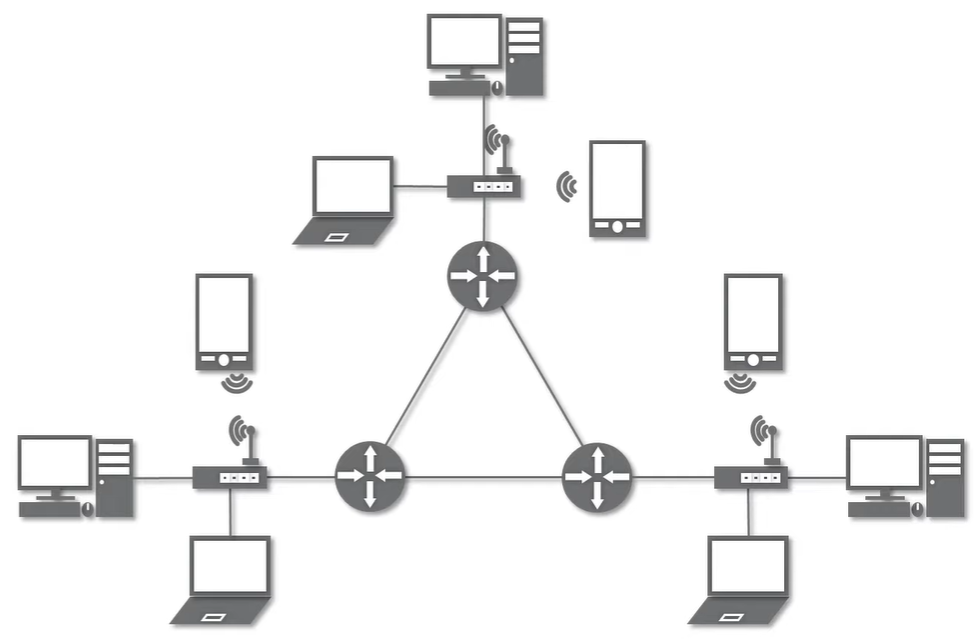
실제 인터넷은 여러 형태를 혼합한 형태 ⇒ `혼합형` 
(여러 개의 LAN 네트워크가 서로 연결 → WAN 네트워크. 특이한 경우 LAN으로만 연결되기도 함.)

## 네트워크의 통신방식
### 네트워크에서 데이터는 어떻게 주고 받는가?
- 유니 캐스트 : 특정 대상이랑만 1:1로 통신(가장 많이 사용)
- 멀티 캐스트 : 특정 다수와 1:N으로 통신(같은 네트워크 대역에서 특정한 다수와 통신)
- 브로드 캐스트 : 네트워크에 있는 모든 대상과 통신(같은 네트워크 대역의 모든 사용자)

## 네트워크 프로토콜
### 프로토콜이란?
- 일종의 약속, 양식.
- 네트워크에서 노드와 노드가 통신할 때 어떤 노드가 어느 노드에게 어떤 데이터를 어떻게 보내는지 작성하기 위한 양식.
- 각 프로토콜들도 해당 프로토콜만의 양식. (택배는 택배만의 양식, 전화는 전화만의 양식 ..)

### 여러가지 프로토콜
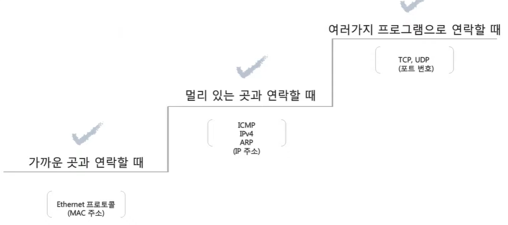
- 여러 상황에 맞는 프로토콜이 있음. 모든 프로토콜은 각각 사용하는 네트워크 주소가 있음.
- 가까운 곳과 통신할 때, Ethernet 프로토콜, Mac 주소 사용
- 멀리 있는 곳과 통신할 때, ICMP/IPv4/ARP 프로토콜, IP 주소 사용
- 특정 프로그램과 통신할 때, TCP/UDP 프로토콜, 포트번호 주소 사용
  - ex: 메신저 프로그램 - 카톡, 라인 동시에 실행 중일 때 어느 프로그램에서 띄워야 하는지 구분

 

- 패킷 : 여러 프로토콜들로 캡슐화 된 것(여러 프로토콜을 함께 사용. 프로토콜이 합쳐진 모양이 '캡슐화')

  

# 실습1 (tracert)

### 구글과 연결 확인

cmd 실행 → `tracert 8.8.8.8` 확인
- tracert : 하나의 프로그램 실행 (trace route)
- 8.8.8.8 : 구글 DNS 서버의 IP 주소

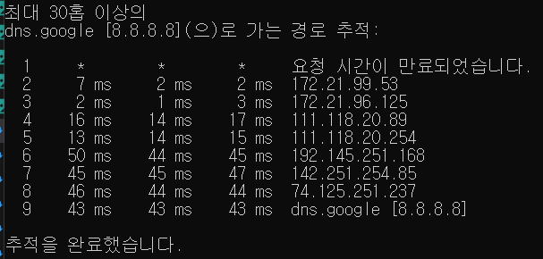

- 구글 DNS 서버와 통신하기 위해 거쳐 간 네트워크 LAN 대역들
- `*` : IP 주소 비공개. 방화벽 등으로 차단. 추적은 못하나 네트워크 통신은 가능하게 해둠.
- 최대 30홉 (홉: 몇개의 네트워크 대역을 넘어가냐 ..)

  

# 실습2 (Wireshark)

### Wireshark 설치
- Wireshark, WinPcap 설치

### 프로토콜 직접 확인
**Wi-Fi 연결**
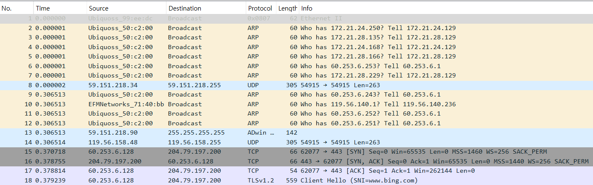

**http 검색 후 다나와, 교보문고 접속**
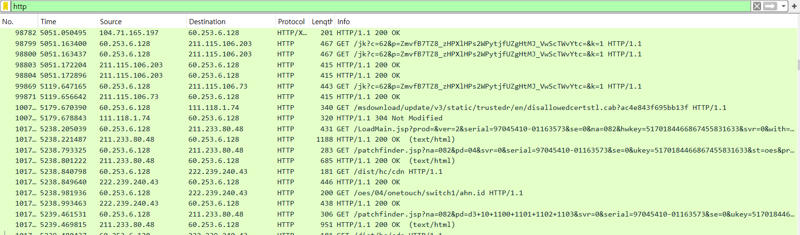
- `HTTP/1.1 200 OK(text/html)` 클릭
- http 프로토콜로 다나와, 교보문고 등 서버의 html, js, css 파일을 받아온 후 http 프로토콜로 전달

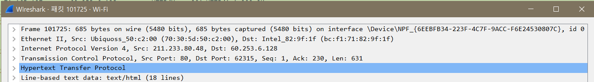
- 멀리 떨어져 있기 때문에 `IPv4(Internet Protocol Version 4)`
- 특정한 컴퓨터 찾음(가까이 있는 컴퓨터) → `Ethernet`
- 사용자가 쓰는 프로그램(크롬)과 접속한 사이트가 서로 연결 → `TCP(Transmission Control Protocol)`
- 여러 프로토콜이 같이 사용됨