출처 : [[따라學IT] 02. 네트워크의 기준! 네트워크 모델](https://www.youtube.com/watch?v=y9nlT52SAcg&list=PL0d8NnikouEWcF1jJueLdjRIC4HsUlULi)

# 네트워크 모델

## 네트워크 계층 모델
### TCP/IP 모델
- 1960년대 말 미국방성의 연구에서 시작되어 1980년대 초 프로토콜 모델로 공개
- 현재의 인터넷에서 컴퓨터들이 서로 정보를 주고받는데 쓰이는 통신 규약(프로토콜)의 모음

|||
|:-:|:-:|
|4계층|응용| 
|3계층|전송| 
|2계층|네트워크| 
|1계층|네트워크 인터페이스| 

### OSI 7계층
- 1984년 네트워크 통신을 체계적으로 다루는 ISO에서 **표준으로 지정**한 모델
- 데이터를 주고받을 때 데이터 자체의 흐름을 각 구간별로 나눠 놓은 것
- TCP/IP 보다 중요

|||
|:-:|:-:|
|7계층|응용| 
|6계층|표현| 
|5계층|세션| 
|4계층|전송| 
|3계층|네트워크| 
|2계층|데이터 링크| 
|1계층|물리| 

## OSI 7계층 모델
### OSI 7계층 모델의 계층별 프로토콜

|계층|프로토콜|
|---- | --- |
| 7계층 응용 | **HTTP**, SMTP, IMAP, POP, SNMP, FTP, TELNET, SSH | 
| 6계층 표현 | SMB, AFP, XDR |
| 5계층 세션 | NetBIOS |
| 4계층 전송 | **TCP**, **UDP**, SPX |
| 3계층 네트워크 | **IP**, **ICMP**, IGMP, X.25, CLNP, **ARP**, RARP, BGP, OSPF, RIP, IPX, DDP |
| 2계층 데이터 링크 | **이더넷**, 토큰링, PPP, HDLC, 프레임 릴레이, ISDN, ATM, 무선랜, FDDI |
| 1계층 물리 | 전선, 전파, 광섬유, 동축케이블, 도파관, PSTN, 리피터, DSU, CSU, 모뎀 |

(**굵은 글씨**는 프로토콜 구조까지 알아두기)

- HTTP : 웹 통신할 때 사용하는 프로토콜

## 두 모델 비교
### 공통점과 차이점

**공통점**
- 계층간 네트워크 모델
- 계층간 역할 정의

**차이점**
- 계층의 수 차이
- OSI는 역할 기반(논리적으로 통신 전반에 걸쳐 역할만 구분), TCP/IP는 프로토콜 기반(네트워크를 통해서 데이터를 전달할 때 기술 자체를 분류) → OSI 논리적 / TCP/IP 실무적
- OSI는 통신 전반에 대한 표준
- TCP/IP는 데이터 전송기술 특화

## 네트워크를 통해 전달되는 데이터, 패킷
### 패킷이란?

- 네트워크 상에서 전달되는 데이터를 통칭하는 말로 네트워크에서 전달하는 데이터의 형식화된 블록
 - 하나의 블록 단위로 되어있음.
- 제어 정보와 사용자 데이터로 이루어지며 사용자 데이터는 페이로드라고도 함.

|||
|:-:|:-:|
|4계층|표현| 
|3계층|전송| 
|2계층|네트워크| 
|1계층|데이터 링크| 

- 패킷 프로토콜들도 순서가 있음. (러시아인형, 택배상자 같은 것.. 작은 것이 밖에 올 수 없음)

 

- 여러 프로토콜들로 캡슐화 된 **패킷**

[ 헤더 | 페이로드 | 풋터 ]

- 페이로드: 실질적으로 보내려고 하는 데이터
  - 앞에 헤더, 뒤에 풋터가 붙을 수도 있음
- 일반적으로 풋터는 잘 사용하지 않음. 대부분 헤더만 사용

예시 
[ Ethernet | IPv4 | TCP | HTTP ]

- HTTP 프로토콜이 페이로드, TCP라는 헤더를 붙임 → 하나의 패킷이 됨
- [TCP, HTTP] 페이로드에 IPv4라는 헤더를 붙임
- [IPv4, TCP, HTTP] 페이로드에 Ethernet이라는 헤더를 붙임
- 패킷의 형태는 정해진 것이 아님. 계속 붙을 수 있음

### 패킷을 이용한 통신과정 - 캡슐화

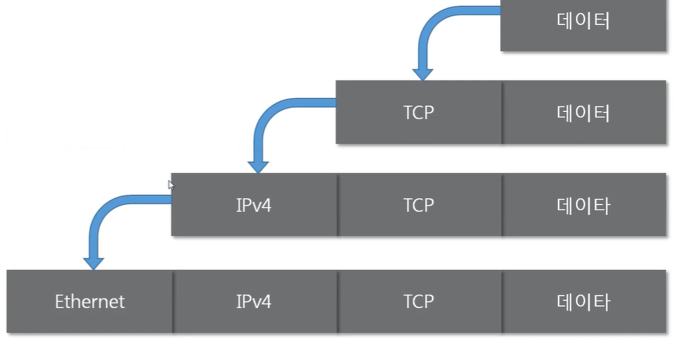

- 여러 프로토콜을 이용해서 최종적으로 **보낼 때** *패킷을 만드는 과정* (Encapsulation)
- 내가 누군가에게 패킷을 보낼 때 사용
  - 예시 : 네이버 웹툰
    - 요청하는 데이터 : 마음의 소리 50화
    - 네이버의 웹서버와 통신해야 하므로 TCP를 캡슐화. 내가 보내는 데이터가 페이로드로써 TCP라는 헤더가 인캡슐레이션
    - [TCP, 데이터] 페이로드가 IPv4 프로토콜을 헤더로 캡슐화. (멀리 가야하니까)
    - [IPv4, TCP, 데이터] 패킷을 페이로드로 해서 Ethernet 프로토콜을 헤더로 캡슐화. (가까운 곳과 통신해야하니까)
- 캡슐화 과정은 *OSI 7계층 모델 또는 TCP/IP 모델*에서 **상위 계층부터 하위 계층**으로 내려가며 프로토콜을 붙임
- 프로토콜을 붙일 때, **하위 프로토콜 앞에 상위 프로토콜이 올 수 없음**. 같은 계층의 프로토콜은 앞에 붙을 수 있음.
  - [ 2계층 | 3계층 | 3계층 | 데이터 ] (가능)
  - [ 3계층 | 2계층 | 4계층 | 데이터 ] (불가능)

### 패킷을 이용한 통신과정 - 디캡슐화

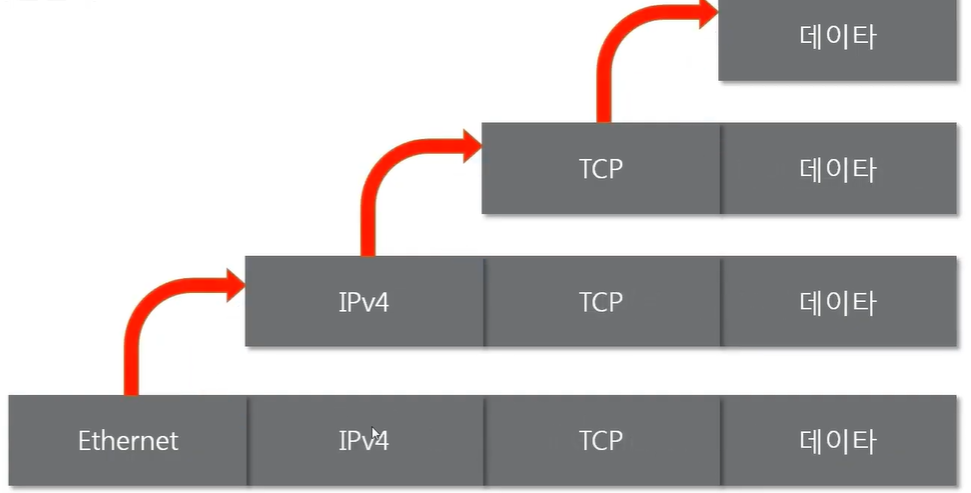

- 패킷을 **받았을 때** 프로토콜들을 하나씩 확인하면서 *데이터를 확인하는 과정* 
  (`[ Ethernet | IPv4 | TCP | 데이터 ]` 같은 패킷을 만들어서 보내주면 데이터를 받는 쪽에서 확인)
- 하위 프로토콜부터 하나씩 보면서 프로토콜의 양식대로 확인 (어떤 데이터를, 어떻게 보냈는지 등) → 최종적으로 보낸 데이터를 확인

### 계층별 패킷의 이름 PDU

- 계층별로 이름이 다른 PDU(Protocol Data Unit) (데이터의 단위)
- 패킷은 각 계층별로 만들어진 모양이 다름. 각 계층에서 패킷을 부르는 용어도 다름

|PDU|계층||
|---|---|---|
|세그먼트|4계층의 PDU|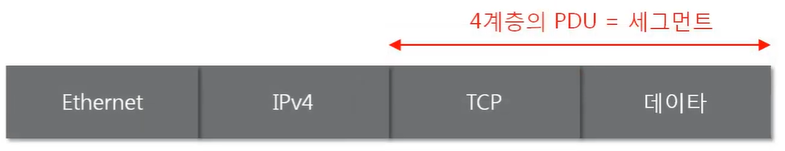|
|패킷|3계층의 PDU|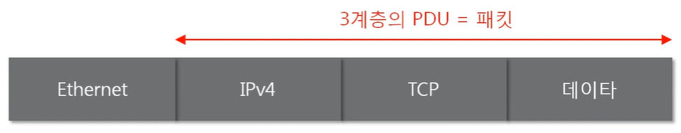|
|프레임|2계층의 PDU|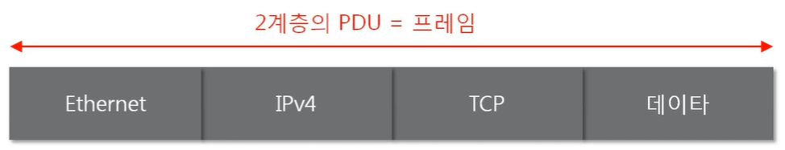|

- 패킷: 3계층까지 붙어있는 경우. 통칭해서 말하는 패킷과는 다른 패킷. 용어는 같지만 뜻이 다름. 일반적으로 패킷을 말할 때, 3계층의 PDU를 말하는 게 아닌, 네트워크 상의 데이터 자체를 말함
- 패킷(통칭)을 가장 많이 쓰고, 좀 더 정확히 얘기할 때 프레임 이라는 용어 사용. 세그먼트까지는 잘 안 씀

### 프로토콜의 캡슐화 된 모습과 계층별 프로토콜 확인해보기

**ARP(3계층 프로토콜) 검색**
- WiFi 연결 → 패킷 캡쳐 멈추기 → 필터에서 ARP 검색

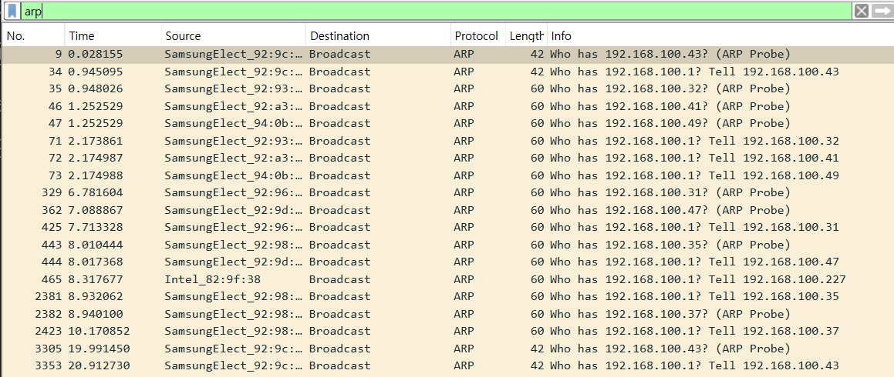

||||
|---|---|---|
|Frame|2계층|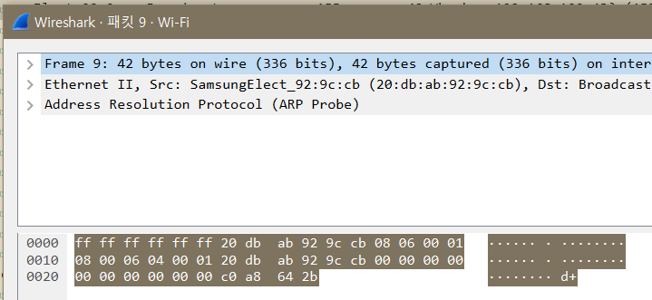|
|Ethernet||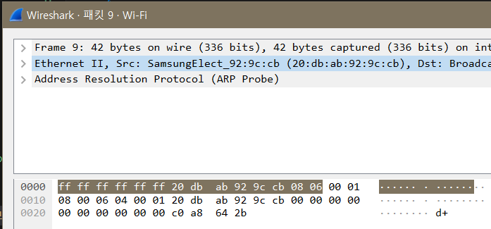|
|ARP|3계층|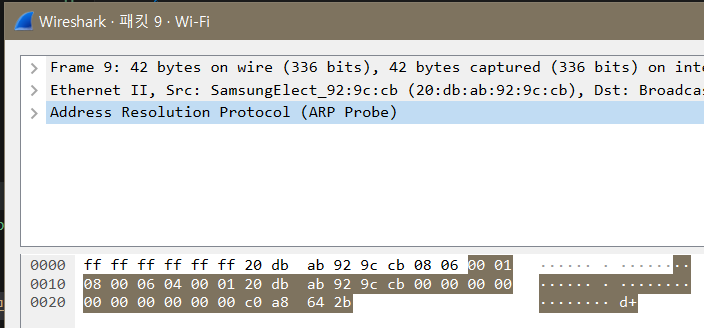|

- Ethernet은 푸터 사용하기도 함
  - 이더넷 프로토콜이 헤더, 뒤에 붙은 것이 푸터, 가운데 페이로드가 ARP 프로토콜
- ARP 프로토콜
  - 자기자신이 헤더, 뒤에 있는 페이로드는 없음(보내는 데이터 X). ARP 프로토콜만 사용

**Ping 8.8.8.8**
- 구글 DNS와 통신 확인

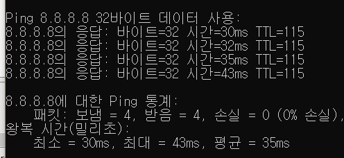

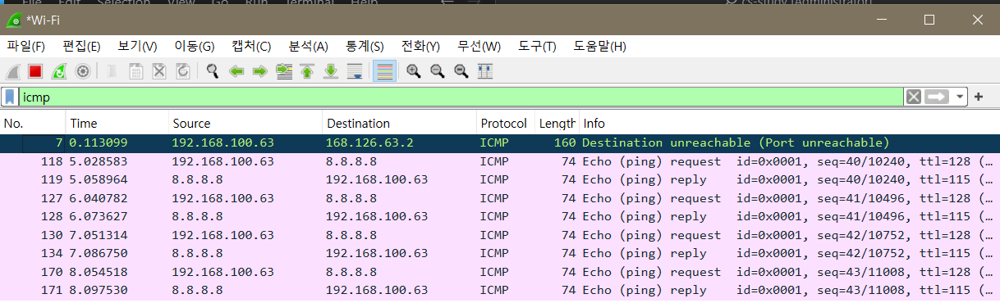

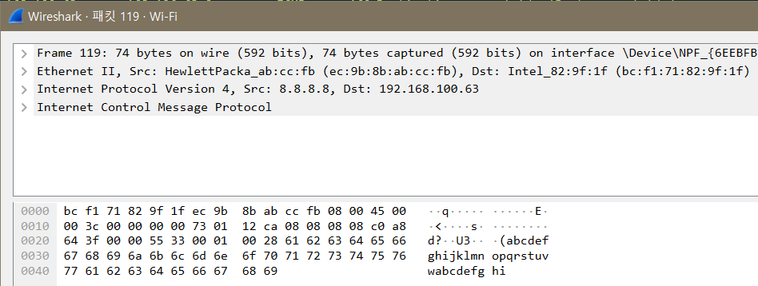

- cmd에서 `ping 8.8.8.8`
- Wireshak에서 `ICMP`(3계층)
- ICMP *(3계층)* - IPv4 *(3계층)* - Ethernet *(2계층)*
  - 같은 계층도 순서가 있음
  - IPv4 앞에 ICP가 붙지 않음 (ICMP - IP - ARP 순서 *(상위 → 하위)*)
  - IP, ARP 같이 쓰이는 경우 없음