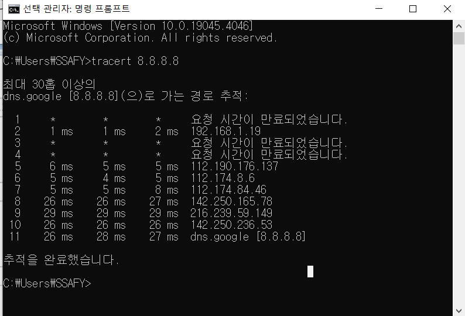

# 1. [실습] 네트워크란 무엇인가?

## 1. 구글과 나는 어떻게 연결되어 있는지 확인해보기

cmd 열어서 구글까지의 경로를 추적한다.

현재 나의 위치부터 구글에까지 갈때 거쳐간 네트워크 대역을 모두 보여주는 중

별로 나온 것은 공개가 안된 것임

- fun fact : 전세계는 15개 이내로 연결되어 있음  
  
- 느낀점
    
    흥미롭다!! LAN과 WAN이 어떤 개념인지 확 닿는다. 연결되어있다는 것도 확 와닿는다.

## 2. Wireshark 설치

Wireshark란?

네트워크 통신을 할때 프로토콜을 캡처해서 어떤 프로토콜을 보냈는지, 받았는지 확인해주는 프로그램

- wifi 들어갔을 때

- http만 검색했을 때

## 3. 프로토콜 직접 확인해보기
- 네이버, 다나와, 교보문고 등을 검색했을때 응답
- 200 OK (text/html)

- HTTP -> TCP(크롬) -> IPv4 (먼 곳) -> Ethernet (가까운 곳)

- 여러 프로토콜이 같이 사용됨. encapsulation

- 느낀점
    - 프로젝트할때는 local 단에서만 응답을 확인했는데 실제 '네이버'에 접속했을 때 응답을 볼 수 있어서 신기하다. 또한 TCP, Ethernet, IPv4 v6 이런 것들이 매번 헷갈렸는데 하나씩 짚으며 알아보니 이해하기가 쉬웠다.