# 2. 네트워크 모델

## 네트워크 모델의 종류
### TCP / IP 모델
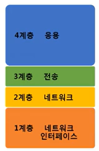
- 현재 인터넷에서 컴퓨터들이 서로 정보를 주고받는데 쓰이는 통신 규약의 모음.
- 1960년 ~ 오래됨.

### OSI 7 계층 모델
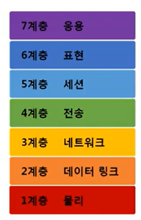
- 1984년 네트워크 통신을 체계적으로 다루는 ISO에서 **표준**으로 지정한 모델
- 데이터를 주고 받을 때 데이터 자체의 흐름을 각 구간별로 나눠 놓은 것

- OSI 7계층 모델의 계층별 프로토콜
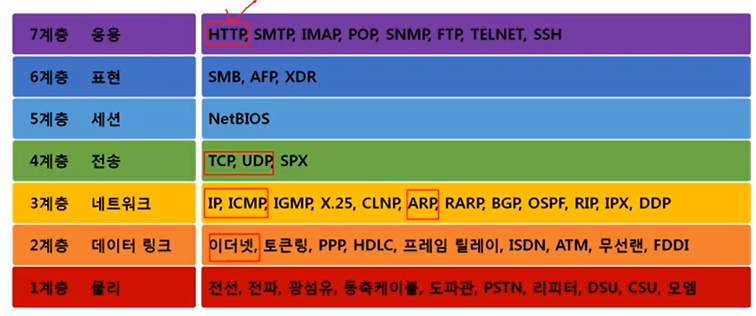

## 두 모델 비교
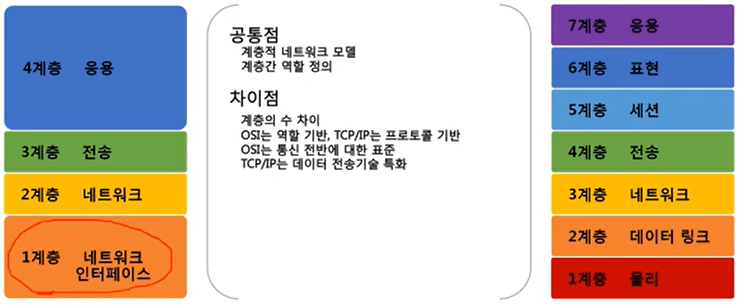
### 공통점
- 계층적 네트워크 모델
- 계층간 역할 정의
### 차이점
- 계층의 수 차이
- OSI는 **역할** 기반, TCP/IP는 프로토콜 기반
- OSI는 통신 전반에 대한 표준
- TCP/IP는 데이터 전송기술 특화

## 네트워크를 통해 전달되는 데이터, 패킷

### 패킷이란?
- 네트워크 상에서 전달되는 데이터를 통칭하는 말로, 네트워크에서 전달하는 데이터의 형식화된 블록이다.
- 패킷은 제어 정보와 사용자 데이터로 이루어지며 사용자 데이터는 페이로드라고도 한다. 
- 여러번 포장된 택배상자 같은 형태 - 순서가 있음. 

### 여러 프로토콜들로 캡슐화된 패킷
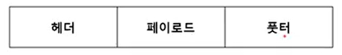
- 푸터는 잘 사용 안함
- "HTTP 라는 프로토콜을 페이로드로 해서 TCP 라고 하는 헤더를 붙였다. = 하나의 패킷이 된 것임. => 다시 이 패킷을 페이로드로 해서 IPv4 프로토콜을 헤더로 붙임 => 다시 이 패킷을 페이로드로 해서 Ethernet 을 헤더로 붙임 "
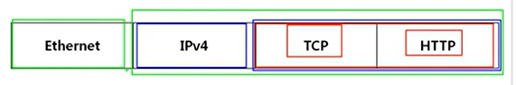

### 패킷을 이용한 통신과정 - 캡슐화
- 요청을 하면,
- 여러 프로토콜을 이용해서 최종적으로 **보낼 때** 패킷을 만드는 과정
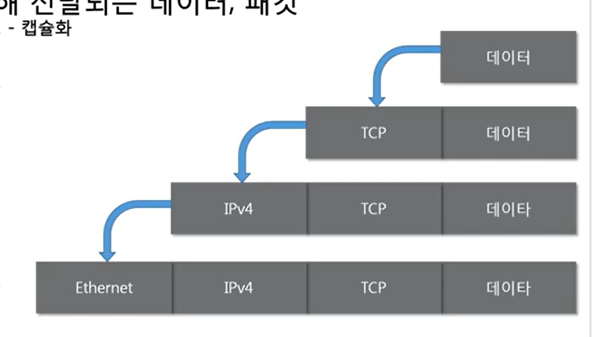

- 데이터: 페이로드 (요청 데이터)
- TCP 프로토콜을 encapsulation   
이걸 반복 반복
- 요청을 보낼때 프로토콜을 하나씩 붙이는 과정을 encapsulation이라고 함

- 순서는 위에서부터 아래로. 
- 상위계층에서부터 하위계층으로 내려가면서 프로토콜을 붙임

### 디캡슐화
- 패킷을 받았을 때 프로토콜들을 하나씩 확인하면서 데이터를 확인하는 과정 
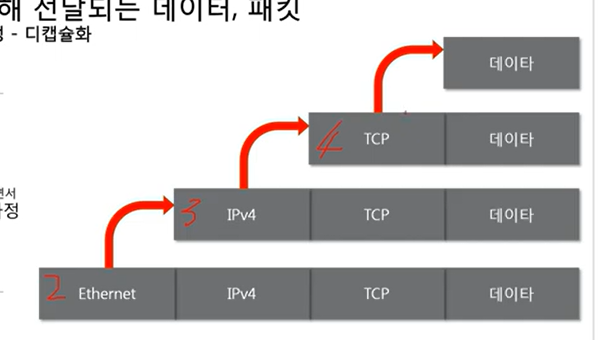

### 계층별 패킷의 이름 PDU
protocal data unit
1. 4계층 = 세그먼트 TCP + 데이터
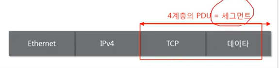
2. 3계층까지 붙은것 = 패킷 
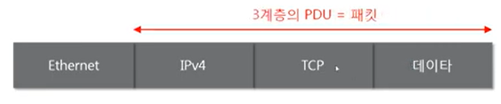
3. 2계층까지 붙은것 = 프레임
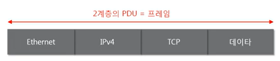

## 실습
- wireshark로 캡처하기
- ARP(3계층)를 사용한 패킷
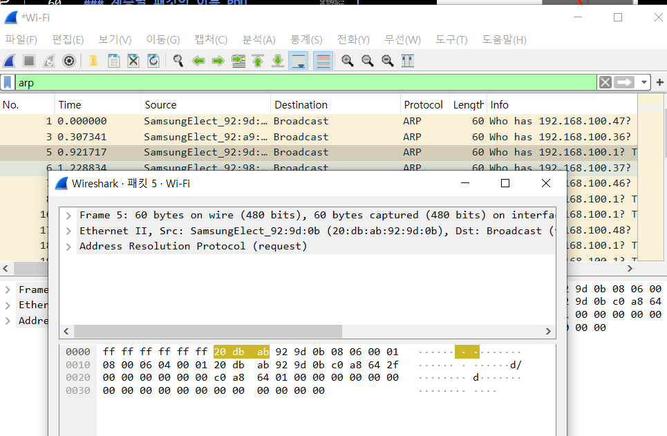

- 패킷 안에서 나뉘어진 것

- 이더넷 - 푸터를 사용해서 끝에 붙어있음 
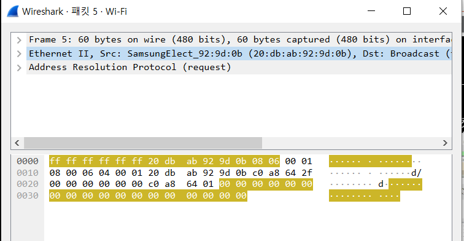

- ARP
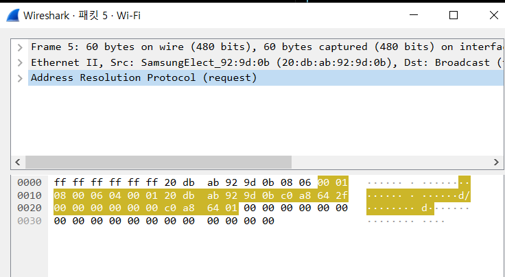

- 이런 형식임  

---
- 또 다른 예시 (3계층 3계층 2계층)
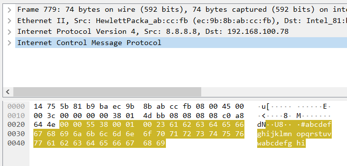

> encapsulation : 높은 계층에서부터 낮은 계층으로  
> decapsulation : 낮은 계층에서부터 높은 계층으로

- 느낀점 : OSI 7 계층을 이론적으로만 알고 있었는데 직접 확인하면서 보니까 이해가 좀 더 된다..