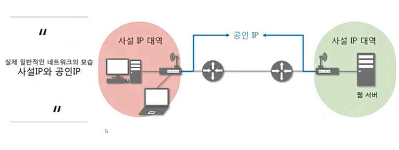
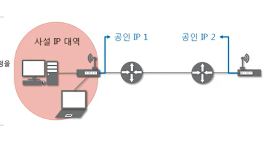
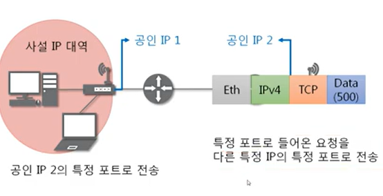
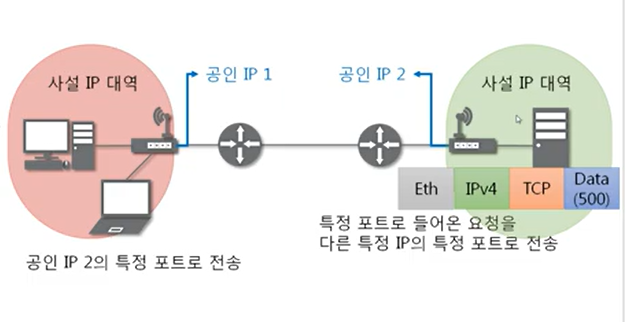
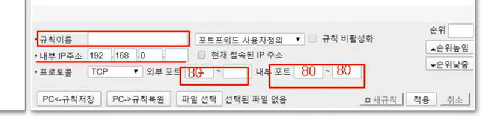
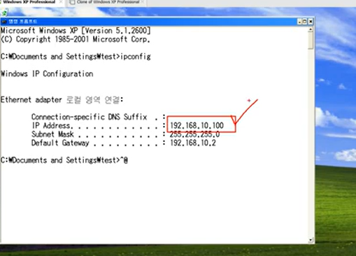
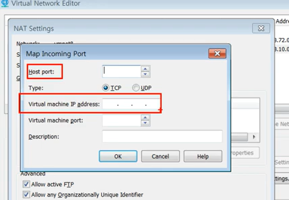
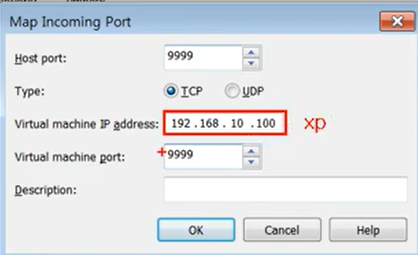

# 10장. NAT와 포트포워딩

## NAT란?

Network Address Translation은 IP 패킷의 TCP/UDP 포트 숫자와 소스 및 목적지의 IP주소등을 **재기록**하면서 라우터를 통해 네트워크 트래픽을 주고받는 기술

패킷에 변화가 생기기 때문에 IP나 TCP/UDP의 체크섬도 다시 계산되어 재기록해야한다.

NAT을 이용하는 이유는 대개 사설 네트워크에 속한 여러개의 호스트가 하나의 공인 IP 주소를 사용하여 인터넷에 접속하기 위함.

하지만 꼭 사설 IP를 공인 IP로 변환하는 데에만 사용하는 기술은 아님.

- 바깥 세상에는 마치 공유기끼리 통신하는 것처럼 보임.

## 포트포워딩?

- 포트포워딩 또는 포트매핑은 패킷이 라우터나 방화벽과 같은 네트워크 장비를 가로지르는 동안 **특정 IP주소와 포트번호의 통신 요청을 특정 다른 IP와 포트 번호로 넘겨주는** 네트워크 주소 변환의 응용이다.

- 이 기법은 게이트웨이(외부망)의 반대쪽에 위치한 사설네트워크에 상주하는 호스트에 대한 서비스를 생성하기 위해 흔히 사용된다.

### 절차

1. 공인 IP로 보냄. 공유기로 보냄.  
   -> 포트 포워딩을 설정해두어야 함.
   -> 특정 포트로 전송을 하면되는데, 목적지 IP는 공인 IP여야 함

2. 공유기는, 특정 포트로 들어온 요청을 다른 특정 IP의 특정 포트로 전송
     
     
   대신 전달해줌

## 실습

1. 포트포워딩 설정해보기

- 다른 사용자들이 사설 IP를 사용하는 서버로 접속할 수 있도록 설정해보기
- 공유기에 접속해서 admin으로 로그인하고 포트포워드 설정하기  
  
- 80으로 설정하는 게 편함.

- 내부 IP 확인  
  

- NAT 세팅
  
  -> 호스트 포트로 들어오면
  -> virtual machine ip address로 들어가라고 알려줌.  
  

2. 사설 IP를 사용하는 서버로 접속해보기
