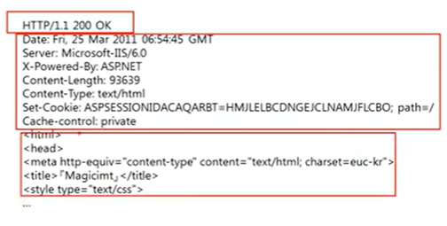
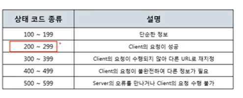

# 11장 (5) 7계층 프로토콜 HTTP 응답 프로토콜

## 응답 프로토콜의 구조

  
바디 부분에 요청한 데이터를 포함해서 전송해줌

- 응답 예시  
  

## 상태코드

- 200 코드는 성공
- 400 클라이언트 요청 문제
- 500 서버 오류

### 200 OK

### 403 forbidden - 권한 없음

### 404 not found - 파일 찾을 수 없음

### 500 설정 오류

### 503 최대 세션 수 초과
