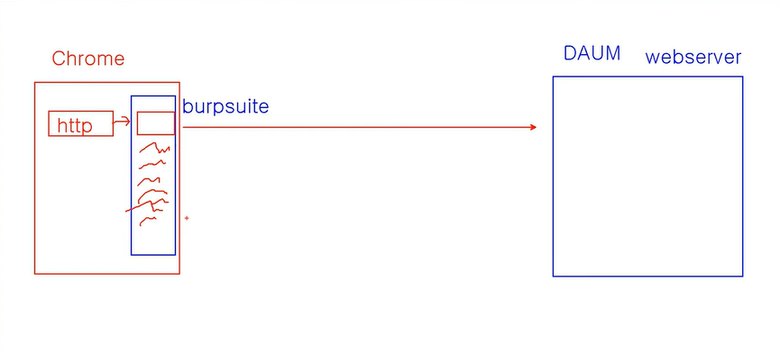
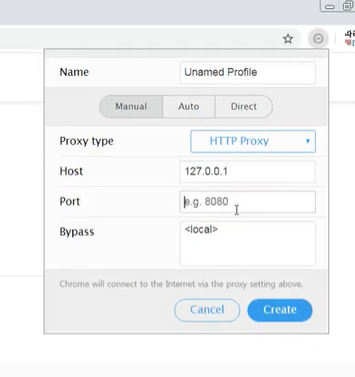

# 11장 (7) 7계층 HTTP 프로토콜 분석 실습

## burpsuite

- Chrome에서 요청을 보낼때 보내기 직전에 중간에 가로채서 조회 또는 수정
  

- 요청을 받을때 받기 직전에 중간에 가로채서 뭔가를 함.

- 버프수트 다운로드, 실행해서
  다 기본으로 ok 하고 프록시에 intercept만 사용

## 2. 구글에서 Falcon Proxy 확장프로그램추가

- 설정해주고 포트번호 7777 설정
  

- 버프수트에 있는 프록시 - 옵션에 들어감
- proxy listener도 동일하게 변경해줌
