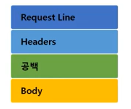
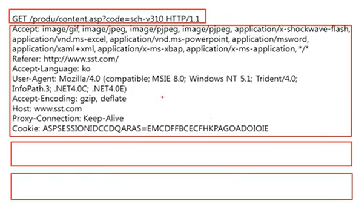
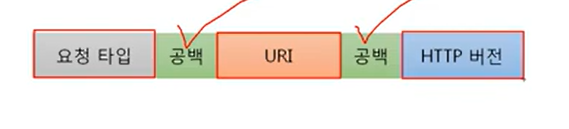
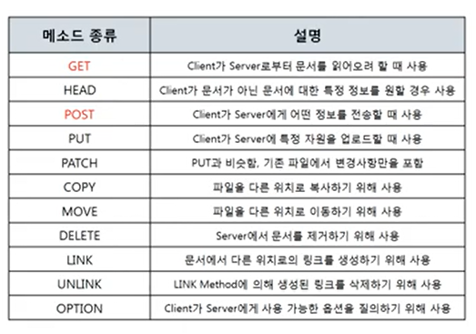
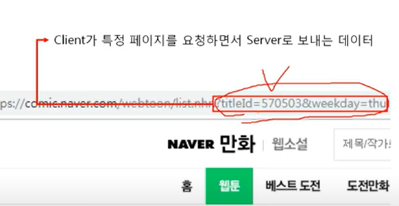
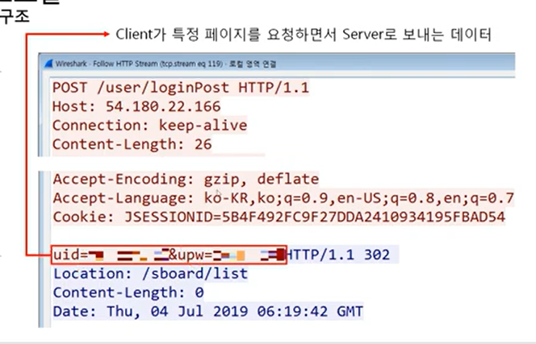
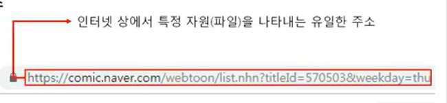
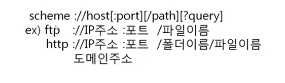

# 11장 (2) HTTP 메소드

## HTTP 요청 프로토콜의 구조

- 요청하는 방식을 정의하고 클라이언트의 정보를 담고 있음
- 요청 프로토콜 예시  
  

- request line 의 구조  
    
   - 요청 타입과 URI가 중요함!

### 요청 방식 종류

- get에서는 주소창에 포함시켜서 보냄
- post에서는 주소창이 아니라 바디에 포함시켜서 보냄

ex)

- get방식  
  
- post 방식  
  

데이터를 보내는 위치가 다름.

## URI

- Uniform Resource Identifier
- 인터넷상에서 특정 자원(파일)을 나타내는 유일한 주소
  
- URL 과 URI 를 혼용해서 썼는데 이제는 URI라 부르는 게 좀더 정확함 (L은 로케이터임)

### URI 구조

http://IP주소:포트번호/폴더이름/파일이름
(도메인주소)
