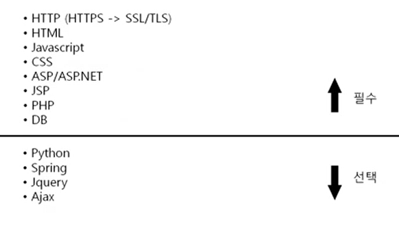

# 11장 7계층 프로토콜 HTTP

- 소켓통신 프로그램은 7계층 프로토콜을 만드는 것과 같음
- 그만큼 7계층 프로토콜은 다양함

## HTTP 프로토콜

### 웹을 만드는 기술들

- 
- html, js, css 이 아이들은 클라이언트 사이드. 그런데 저장이 서버쪽에 되어있음.
- 그것을 받아오는 프로토콜이 HTTP임

- ASP, JSP(javaserver pages), PHP 이거는 서버쪽 페이지를 만드는 기술들

### HTTP 프로토콜의 특징

HyperText Transfer Protocol 하이퍼 텍스트 전송 프로토콜

- www에서 쓰이는 핵심 프로토콜로 문서의 전송을 위해 쓰인다.
- 특징: 요청, 응답 시스템에 기반

- HTTP 1.0 - 연결 수립, 동작, 연결 해제 등 단순함.
  -> 문제점: 네트워크 부하가 심함. 3wayhandshake 하고 요청, 응답, 끊고 다시 또 연결하므로

- HTTP 1.1은 한번 연결하면 요청, 응답을 계속 할 수 있도록.

## HTTP 요청 프로토콜

## HTTP 응답 프로토콜

## HTTP 헤더 포맷
