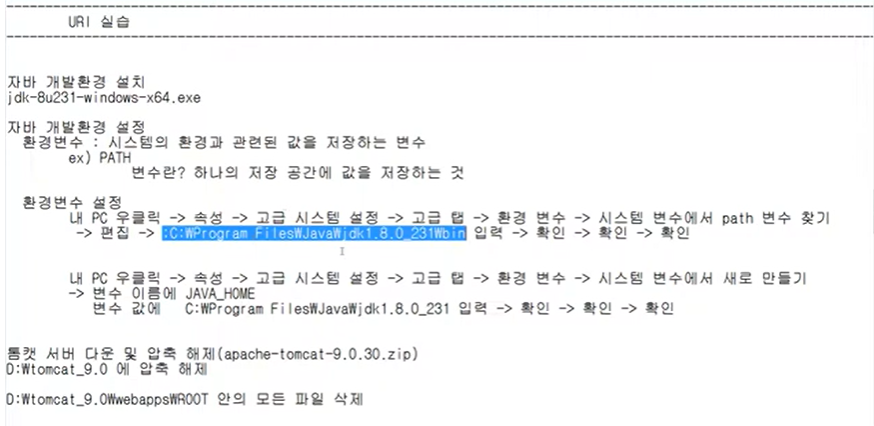
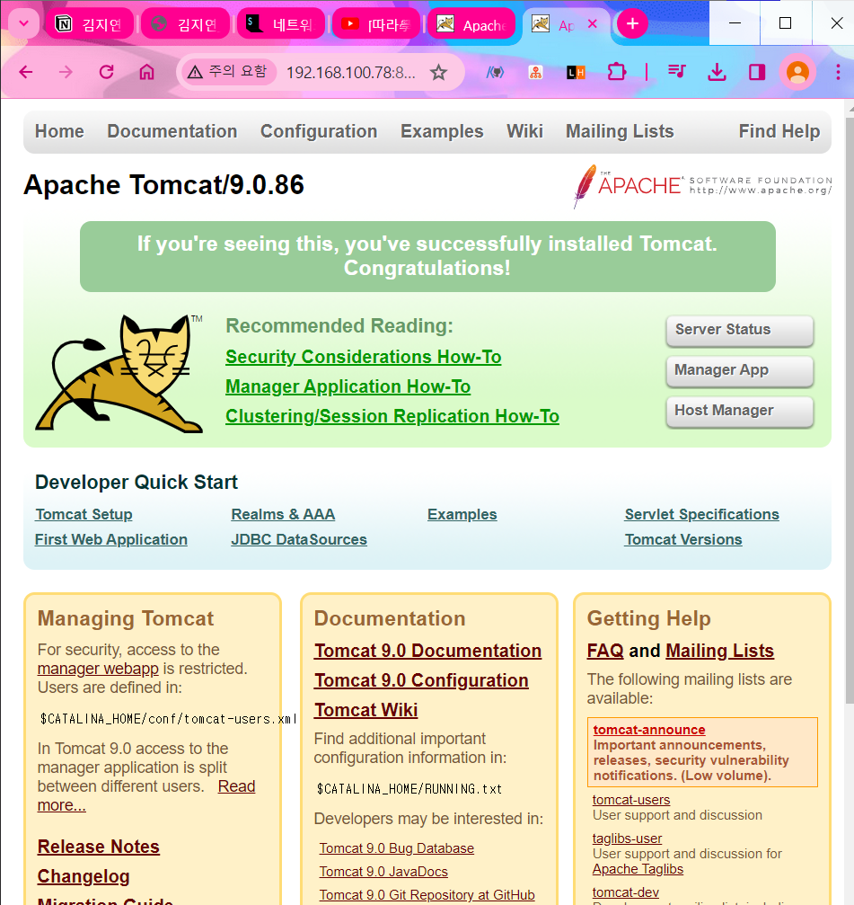
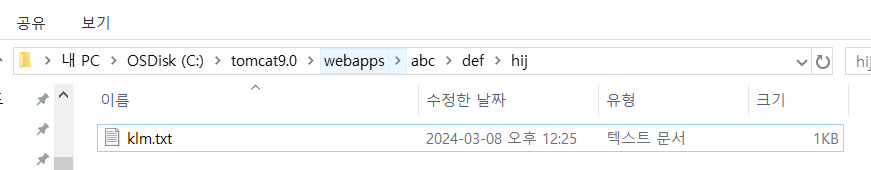
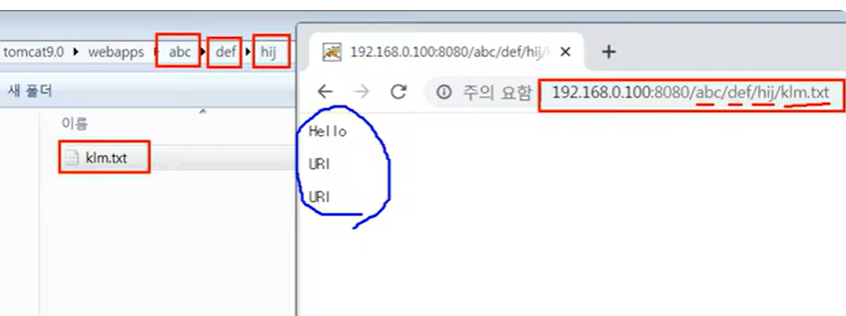

# 11장 (4) HTTP URI 실습

- 실습 환경 세팅
  

1. 자바 개발환경 설치

2. 자바 개발환경 설정

   - 환경변수 : 시스템의 환경과 관련된 값을 저장하는 변수
     ex ) PATH 변수란? 하나의 저장 공간에 값을 설정하는 것

3. 웹 서버 설치 : 아파치 톰캣 압축 풀면 됨

- c 드라이브에 넣고 tomcat9.0이라고 폴더이름 바꿈
- bin 에 들어가서 startup.bat 실행
- 실행되면 브라우저에서 내 IP주소 입력하고 포트번호를 8080으로 씀.
  

- 웹서버 세팅 끝

- 파일을 하나 만듦  
  

- 주소창에 있는 건 서버에 파일이 있는 경로라는 것임..!  
    
  uri 중에 path 를 쳐본 것임.
