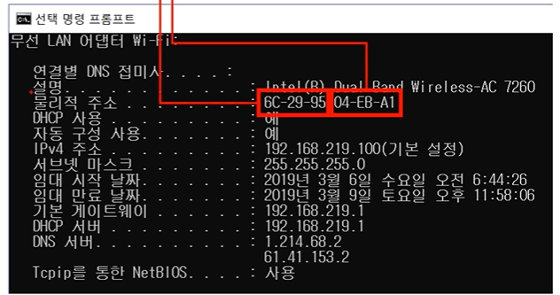
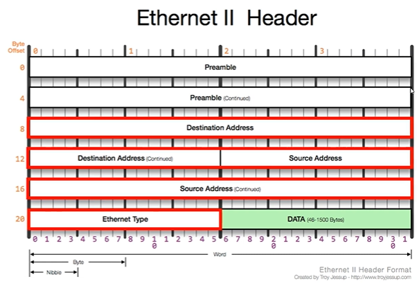
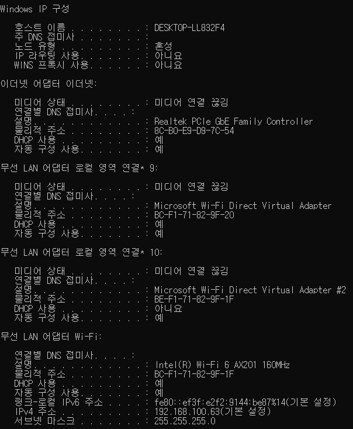
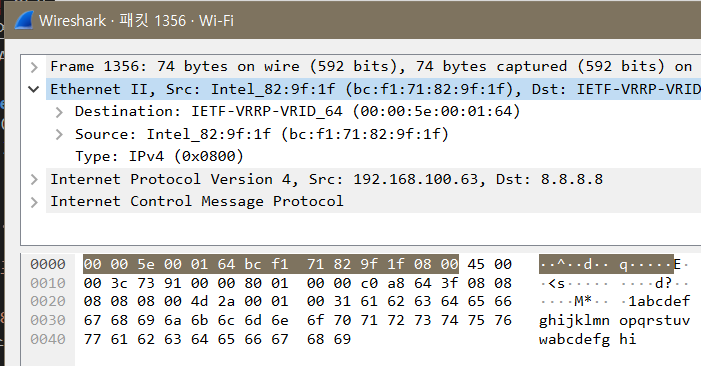

출처 : [[따라學IT] 03. 가까이 있는 컴퓨터끼리는 이렇게 데이터를 주고받는다](https://youtu.be/HkiOygWMARs?list=PL0d8NnikouEWcF1jJueLdjRIC4HsUlULi)

# 데이터 통신

## 2계층에서 하는일
### 2계층의 기능

- 2계층은 **하나의 네트워크 대역**(LAN대역) 즉, **같은 네트워크 상**에 존재하는 여러 장비들 중에서 **어떤 장비**가 **어떤 장비**에게 보내는 데이터를 전달
- 추가적으로 <U>오류제어, 흐름제어</U> 수행 (오류유무 체크 오류제어, 누가 누구에게 데이터 보내는지 흐름제어)

### 2계층의 네트워크 크기

- 2계층은 **하나의 네트워크 대역 LAN**에서만 통신할 때 사용
- 다른 네트워크와 통신할 때는 항상 **3계층**이 도와주어야 함(2계층만으로는 다른 네트워크 대역과 통신 불가)
- 3계층의 주소와 3계층의 프로토콜을 이용하여야만 다른 네트워크와 통신이 가능

## 2계층에서 사용하는 주소
### 물리적인 주소

- **MAC 주소** : LAN에서 통신할 때 사용하는 주소(다른 말로, <U>물리적인 주소</U>라고도 함. 물리적인 장비가 부여받은 고유한 주소값이기 때문)
- `물리적 주소`가 MAC주소!
  - 12개의 16진수로 이루어져있음(2개씩 구분 : `6C-29-95-04-EB-A1`. `-` 또는 `:`으로 구분)
  - `6C-29-95` → **OUI** : IEEE에서 부여하는 일종의 제조회사 식별 ID (ex: 삼성을 나타내는 고유값)
  - `04-EB-A1` → **고유번호** : 제조사에서 부여한 고유번호 (ex: 삼성에서 부여한 고유번호)
- MAC주소는 전세계 모든 장비들이 서로 다른 주소를 가지고 있음
- 하드웨어 장치에 직접적으로 부여되는 값. (일반적으로) 쉽게 바꿀 수 없음

## 2계층(Ethernet) 프로토콜

### Ethernet 프로토콜
- LAN에서 통신할 때 사용

(빨간 부분만 보면 됨)

- Ethernet이 헤더로 붙었을 때의 모양
- DATA : Ethernet 입장에서 페이로드
- 그림에서 한줄이 4byte. 총 14byte.

- `Destination Address`(목적지 주소)
- `Source Address`(출발지 주소)
- `Ethernet Type` 으로 나누어져 있음

- **Ethernet 프로토콜의 목적지 주소**(Destination Address)**에 MAC주소가 옴**
  - Destination Address는 6Byte(Address가 MAC주소 의미)
  - MAC주소가 6Byte(16진수 2개당 1Byte → 12개 : 6Byte)
  - 통신할 때 <U>받는 사람의 MAC주소가 목적지 주소</U>에 오게 됨
- 목적지 MAC주소 6Byte
- 출발지 MAC주소 6Byte
- 나머지 (Ethernet Type) 2Byte

- 예시
  - 보내는 사람(A) MAC주소 = `AA:AA:AA:AA:AA:AA`
  - 받는 사람(B) MAC주소 = `BB:BB:BB:BB:BB:BB`
  - A가 B에게 데이터를 보낼 때 
    목적지 MAC주소: BBBBBBBBBB 
    출발지 MAC주소: AAAAAAAAAA

- Ethernet Type
  - 페이로드(DATA) 안의 상위 프로토콜이 뭔지 미리 알려줌 
    - `0800` : IPv4 프로토콜이 있다
    - `0806` : ARP 프로토콜이 있다
    - 3계층 프로토콜 미리 알려줌
  - 미리 알려주면 분석하기 편함
  - 정확히는, 안 알려주면 무슨 프로토콜인지 알 수 없음
  - 보통 다른 프로토콜들도 이런 식으로 상위 프로토콜이 뭔지 알려줌

## 실습

### 내 PC의 MAC주소 확인해보기
- 윈도우에서 간단하게 내 PC의 MAC주소를 확인하는 법

1. CMD 실행
2. `ipconfig /all` 입력 
  
  - 로컬 영역 연결 : 인터넷 할 때 사용하는 네트워크 장치
  - 로컬영역연결의 물리적주소가 내PC의 MAC주소 : `BE-F1-71-82-9F-1F` 
    (OUI는 MAC주소 OUI 확인해주는 사이트에서 확인가능)

### Ethernet 프로토콜 캡쳐·분석
- Wireshark 이용해 Etherent 프로토콜이 어떻게 생겼는지 직접 확인 후 내 MAC주소, 목적지 분석

1. CMD 실행
2. `ping 8.8.8.8` 입력
3. Wireshark - Wi-Fi - 필터 ICMP 
  
    - `00 00 5e 00 01 64` `bc f1 71 82 9f 1f` `08 00`
    - 목적지 / 내MAC주소 / 이더넷타입