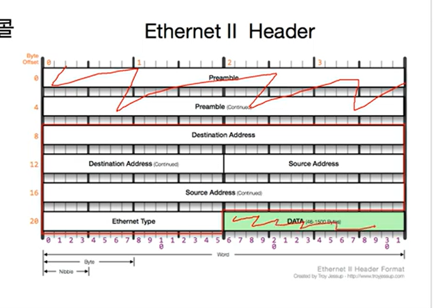
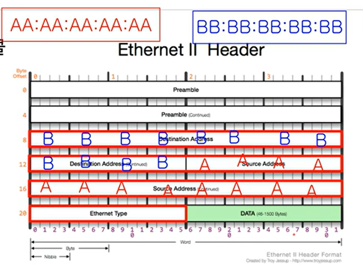
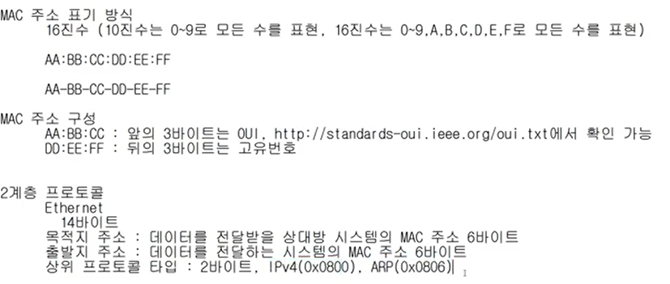

# 3. 데이터 통신
24년 2월 23일 금요일 
가까이 있는 컴퓨터끼리는 이렇게 데이터를 주고 받는다

OSI 7계층에서 2계층 이야기
2, 3, 4계층 주소체계를 알아두어야함  

## 2계층에서 하는 일

### 2계층의 기능
- 2계층은 하나의 네트워크 대역 (LAN 대역)에 존재하는 여러 장비들 중에서 어떤 장비가 어떤 장비에게 보내는 데이터를 전달.
- 추가적으로 오류제어, 흐름제어 수행

### 2계층의 네트워크 크기
- 하나의 네트워크 대역에서만 통신할 때 사용
- 다른 네트워크 대역과 통신할 때는 항상 **3계층**이 도와주어야 한다.

## 2계층에서 사용하는 주소
### MAC 주소 - 물리적인 주소
- LAN에서 통신할 때 사용
- 12개의 16진수로 표시되어 있음
- 앞 6자리: OUI : IEEE 에서 부여하는 제조회사 식별 ID
- 뒤 6자리: 고유번호: 제조사에서 부여한 고유번호

## 2계층의 프로토콜
### Ethernet 프로토콜
- 이더넷 프로토콜이 헤더로 붙었을 때의 모양

- Destination Address : 목적지 MAC주소 6바이트
- Source Address : 출발지 MAC주소 6바이트

- 출발지가 AA:AA:AA:AA:AA 도착지가 B~ 일때

- Ehternet Type : 상위 프로토콜이 뭔지 알려주는 거

---

## 실습

###  1. 내 물리적 주소 확인하기
- cmd에 ipconfig /all 을 친다
- 물리적 주소가 MAC 주소임

- 맥주소의 OUI 확인하는 법

### 2. 이더넷 확인하기
- wire shark를 켜고 LAN 내에 있는 컴퓨터에 ping 을 하면 볼 수 있음.
