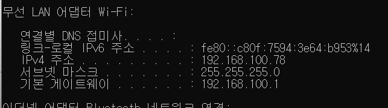
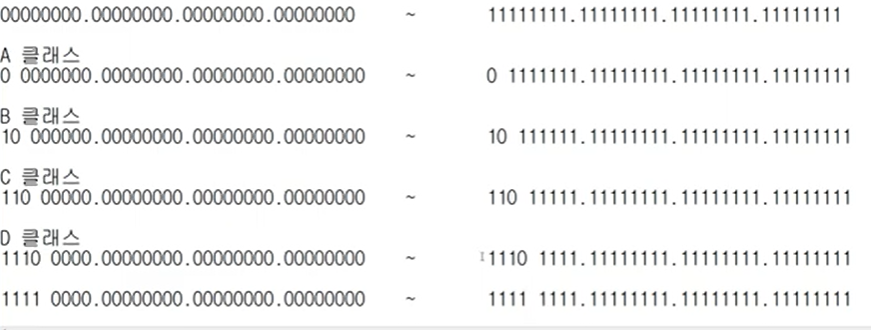

# 4장 IP 주소
24년 2월 23일 금요일  
- 실제로 컴퓨터끼리는 IP 주소를 사용해 데이터를 주고 받는다
- MAC 주소는 사람이 입력하기 복잡해서 IP를 사용함
- IP 주소는 3계층에서 사용한다.

## 3계층의 기능
### 3계층에서 하는 일
- 서로 다른 네트워크 대역 LAN 과 LAN을 연결해준다.
- 멀리 떨어진 곳에 존재하는 네트워크까지 어떻게 데이터를 전달할지 제어하는 일을 담당.
- 발신에서 착신까지의 패킷의 경로를 제어한다.

### 3계층에서 쓰는 주소
- IP 주소  WAN에서 통신할 때 사용하는 주소.
- cmd 에서 ipconfig를 친다.

- IPv4주소 : 현재 PC에 할당된 IP 주소
- 서브넷 마스크 : IP 주소에 대한 네트워크의 대역을 규정하는 것
- 게이트웨이 주소 : 외부와 통신할 때 사용하는 네트워크의 출입구

### 3계층 프로토콜
- ARP 프로토콜

- IPv4 프로토콜
(IPv6로 넘어가려는 추세가 쭉 이어지는 중..)

- ICMP 프로토콜

## 일반적인 IP 주소 (IPv4)
### Classful IP주소

- 10진수로 써서 0~255 까지 쓸수있음.
- 낭비가 심하다.
- 클래스가 어떻게 구분되는지 알 필요는 없을듯

-- 27분 33초까지

### 