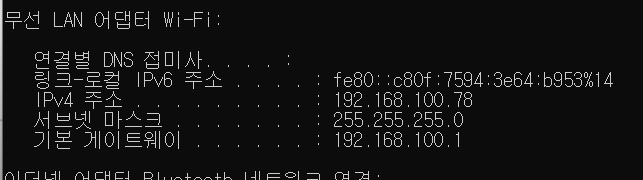
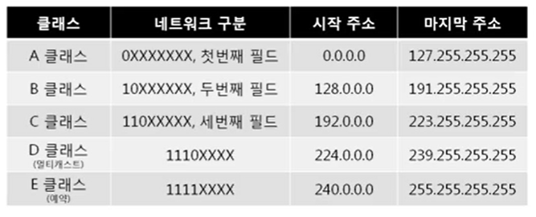
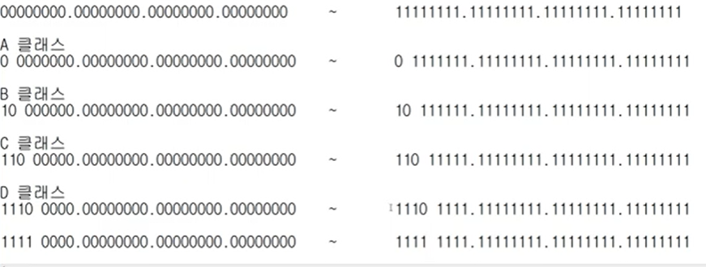
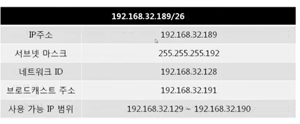
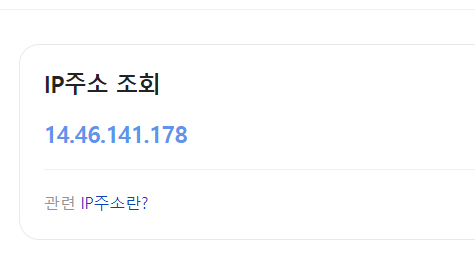
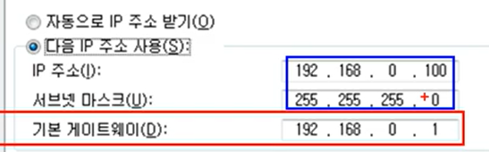
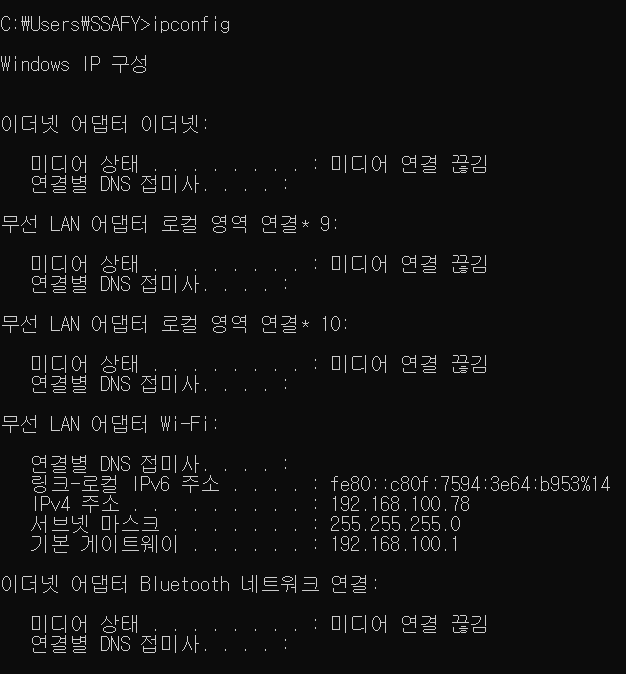
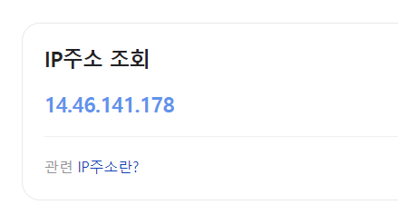

# 4장 IP 주소

24년 2월 23일 금요일

- 실제로 컴퓨터끼리는 IP 주소를 사용해 데이터를 주고 받는다
- MAC 주소는 사람이 입력하기 복잡해서 IP를 사용함
- IP 주소는 3계층에서 사용한다.

## 3계층의 기능

### 3계층에서 하는 일

- 서로 다른 네트워크 대역 LAN 과 LAN을 연결해준다.
- 멀리 떨어진 곳에 존재하는 네트워크까지 어떻게 데이터를 전달할지 제어하는 일을 담당.
- 발신에서 착신까지의 패킷의 경로를 제어한다.

### 3계층에서 쓰는 주소

- IP 주소 WAN에서 통신할 때 사용하는 주소.
- cmd 에서 ipconfig를 친다.

- IPv4주소 : 현재 PC에 할당된 IP 주소
- 서브넷 마스크 : IP 주소에 대한 네트워크의 대역을 규정하는 것
- 게이트웨이 주소 : 외부와 통신할 때 사용하는 네트워크의 출입구
  

### 3계층 프로토콜

- ARP 프로토콜

- IPv4 프로토콜
  (IPv6로 넘어가려는 추세가 쭉 이어지는 중..)

- ICMP 프로토콜

## 일반적인 IP 주소 (IPv4)

### Classful IP주소

- 10진수로 써서 0~255 까지 쓸수있음.
- 낭비가 심하다. -> IP주소가 부족해짐
- 클래스가 어떻게 구분되는지 알 필요는 없을듯
  

### Classless IP 주소

  
클래스풀 ip로 했을 때 ip주소가 부족해져서 보완책

굳이 . 이 찍힌 구분이 아니라 자르고 싶은 구간 아무데에서든 잘라서 쓰기

- 서브넷 마스크 도입

> 서브넷 마스크
>
> - 클래스풀한 네트워크 대역을 나눠주는 데 사용하는 값
>   어디까지가 네트워크 대역을 구분하는 데 사용하고 어디서부터 호스트를 구분하는 데 사용하는지 지정
> - 2진수로 표기했을 때 1로 시작, 1과 1사이에는 0이 올 수 없다는 규칙을 가지고 있다.

- 그래서 IP 주소는 항상 서브넷마스크랑 같이 쓴다.

- 서브네틱 : 잘게 자르는 과정
- 슈퍼네틱 : 통합하는 과정

### 사설 IP 와 공인 IP

- 공인 IP : 인터넷 세상 네트워크 통신망, 통신시 사용하는 IP 주소
- 사설 IP : 같은 네트워크 대역에서 사용하는 IP주소

-> 사설 IP들이 다른 네트워크 대역으로 갈 때 공인 IP로 변경해서 간다.

ex) 내 아이피 주소 검색하면 하나만 나오는데, (공유기에 할당된 ip)  

내 로컬에서 ip config를 보면 다 다르게 나온다.

- NAT : 공인 IP로 받아온 정보를 사설 IP에 뿌려주는 과정. IP 부족 문제를 해결하기 위함.

- 실제 인터넷 세상에서는 공인 IP로만 통신하므로 외부 네트워크 대역에서는 사설 IP 대역이 보이지 않는다.

- 공인 IP 하나당 2^32 개의 사설 IP

## 특수한 IP 주소

1. Wildcard 0.0.0.0 : 나머지 모든 IP

2. 127.0.0.1 : 나 자신을 나타내는 주소

3. 게이트웨이 주소 : 어딘가로 가려면 일단 여기로. 문짝!

---

## 실습

1. 내 PC의 IP 주소 확인하기
   cmd - ipconfig  
   

2. 네이버에서 공인 IP 주소 확인  
   
