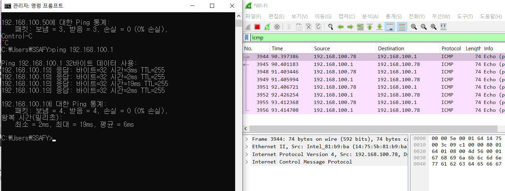
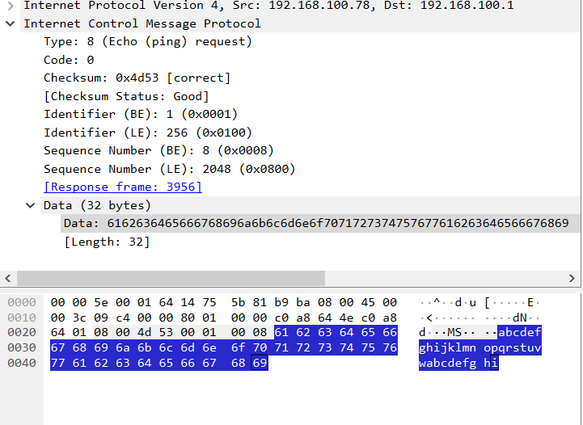
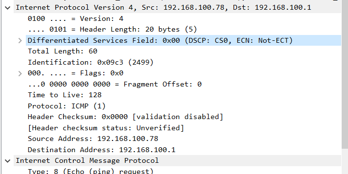
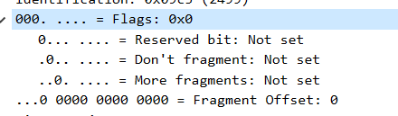
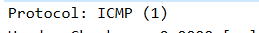
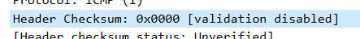
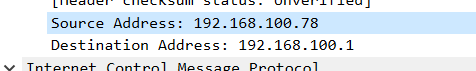

## IPv4 ICMP 실습

1. cmd 로 ping 했을때  

2. 들어가보면

앞에있는 8바이트만 ICMP 임. 
- 요청이면 type이 8

3. IPv4

4. Flags  
  
조각화 여부에 따라

5. TTL 
윈도우 128로 지정됨, 하나씩 줄어듬

6. 프로토콜  
  
상위 프로토콜 타입을 알려줌

7.  체크섬
  

8. 출발지, 목적지

