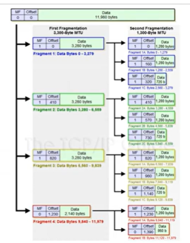
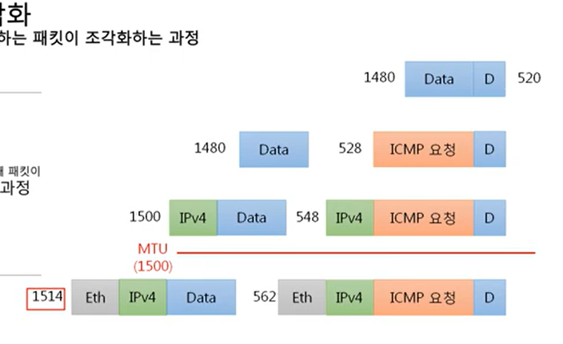
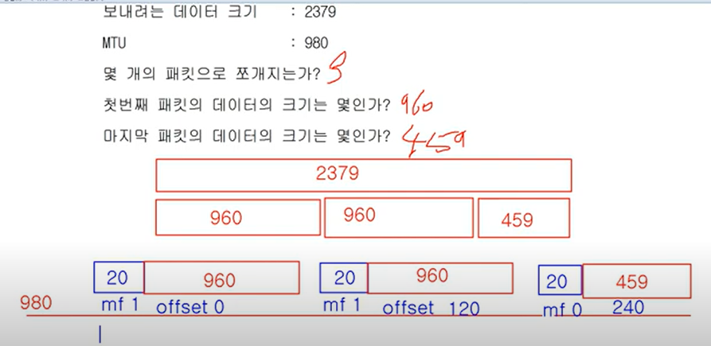
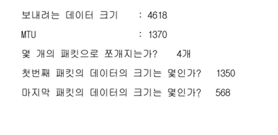
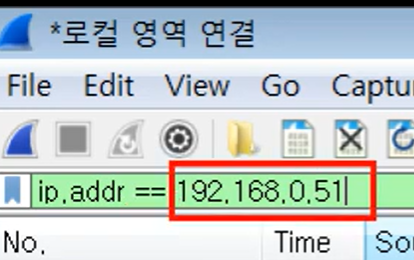

# 6장 IPv4의 조각화

## 조각화란?

큰 IP 패킷들이 적은 MTU (maximum transmission unit 데이터 최대 전송 단위)를 갖는 링크를 통하여 전송되려면 **여러 개의 패킷으로 쪼개어 전송**돼야 한다.

- 조각화 예시
  -> 여러 개의 패킷으로 조각화된 패킷

- MF : more fragment 뒤에 조각이 더 온다는 것을 알려주는 flag

- 네개의 패킷이 각자 ip 프로토콜이 encapsulation 되어있음. id값은 모두 같음.

#

  
이렇게 잘라내서 보냄

### 실습

---

