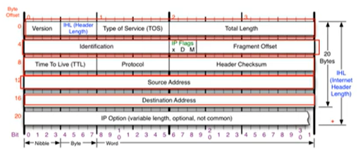
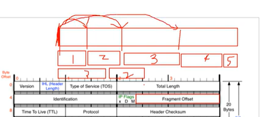

# 6장 IPv4 ICMP 프로토콜 [1] - IP 프로토콜 구조

24.02.27 화요일

## IPv4가 하는 일

- 네트워크 상에서 데이터를 교환하기 위한 프로토콜
- 데이터가 **정확하게 전달될 것을 보장하지 않는다**
- 중복된 패킷을 전달하거나 패킷의 순서를 잘못 저달할 가능성도 있다. (악의적으로 이용되면 DoS 공격이 됨)

## IPv4 프로토콜의 구조

  
20바이트라고 생각하면 됨.

IP 주소 출발지 4바이트, 목적지 4바이트

1. version : 4
2. IHL : header length 20~ 60 인데, 4바이트라서 /4 한거를 표기함. 일반적으로 5.
3. Type of Service : 0 0 지금은 쓰이지 않음
4. total length : 헤더 + 페이로드까지 전체 길이
5. identification , IP flags, Fragment Offset : 잘게 쪼개진 애들을 알아볼때 사용하는 친구들.

- ip flags
  - x, D 는 안씀
  - M more fragmntation 조각화가 돼있으면 뒤에 더 있다는 것을 알려주는 것.
- fragment offset 13bit : 맨 앞에서부터 얼마만큼 떨어져있는지.  
  

6. TTL time to live : 패킷이 살아있을 수 있는 시간을 지정. 잘못 설정하는 경우에 대비함. 값이 0 이 되면 더이상 전달하지 않고 버림.

7. Protocol - ICMP, TCP, UDP

8. Header Checksum - 세팅된 값과 헤더 체크섬 값을 비교해서 맞는지 아닌지 확인.
