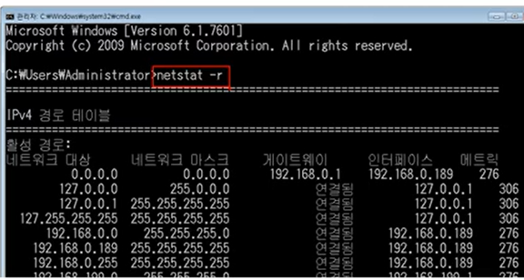
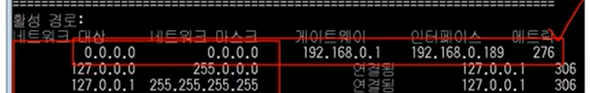
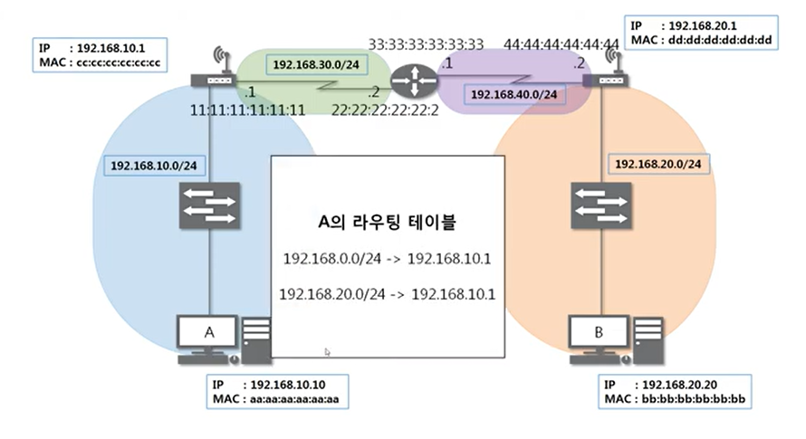
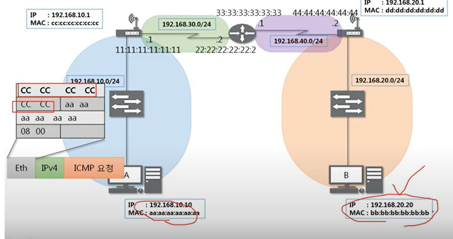
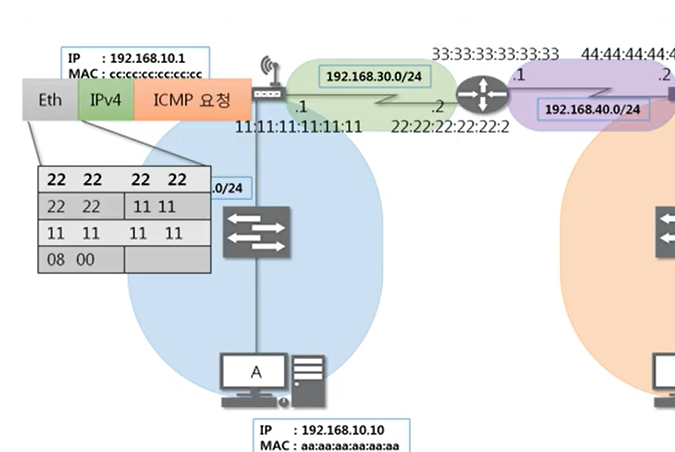
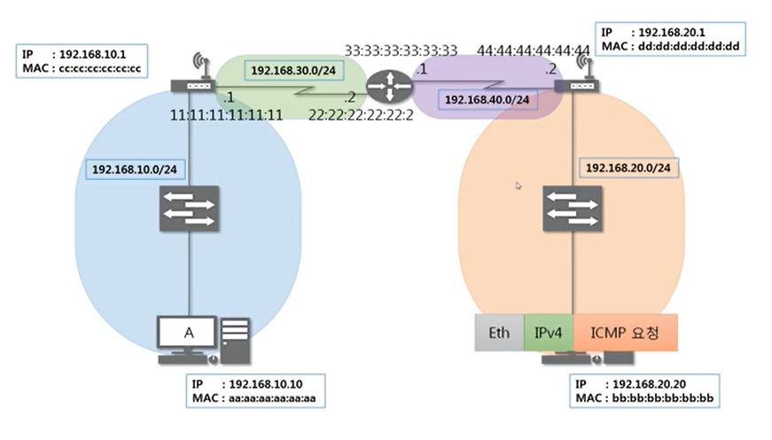
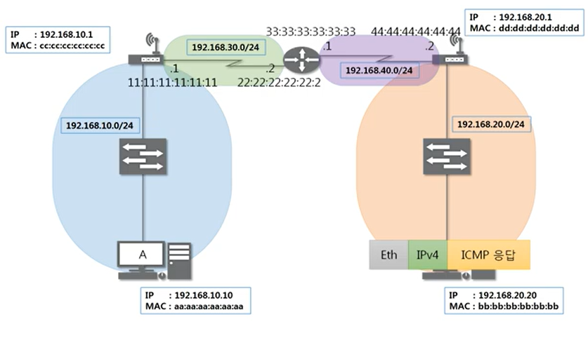
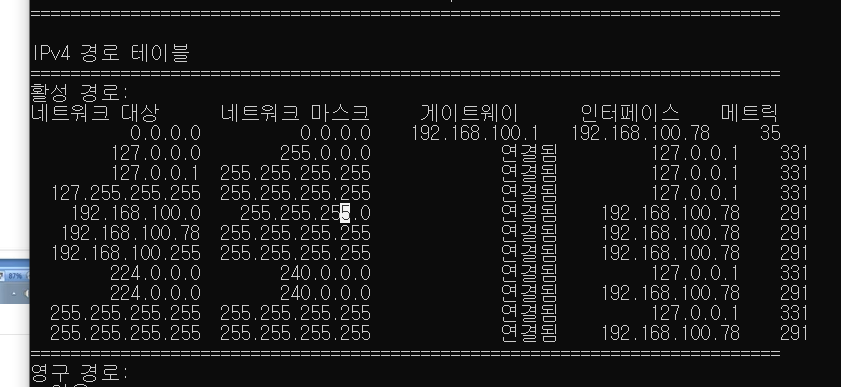

# 6장 라우팅 테이블

## 라우팅 테이블
어디로 보내야하는지 설정되어 있음  
  
netstat 입력.
라우팅 테이블에 적혀있는 곳만 찾아갈 수 있음.  

그래서 기본값을 넣어줌.  
  

## 다른 네트워크와 통신 과정
1. A와 B가 통신할 때  
  
B의 네트워크 대역이 A의 라우팅 테이블이 있어야함.

  
ICMP 프로토콜 작성. 
요청이니까 08

  
목적지 맥 주소는 c임!
- 이더넷은 가까운 곳만 갈수있으므로 갈수 있는 곳.

2. 공유기에 도달했을 때
  
패킷을 까보고, 다음 목적지까지 가도록 이더넷프로토콜을 수정해서 다시 보낸다.

3. 그 다음 또 보고 라우팅 테이블 확인 -> 
다시 이더넷 프로토콜을 짠다.

* 이더넷 프로토콜 : 네트워크 대역이 바뀔때마다 새로 작성됨.

4. 이 과정을 반복하면 도착.
  
하나씩 까보고 본인에게 요청이 온것이면 ICMP응답을 작성해서 다시 같은 과정을 거쳐 돌아감.  

  

---

## 실습
- cmd 에 netstat -r 입력  

IPv4 경로 테이블 == 라우팅 테이블

