# 7장 4계층 프로토콜

## 컴퓨터의 프로그램끼리는 이렇게 데이터를 주고 받는다.

2024.03.04

- 쉽게 생각하면 클라이언트 서버 개념

## 4계층 프로토콜

- 전송계층은 송신자의 프로세스와 수신자의 프로세스를 연결하는 통신 서비스를 제공한다.
- 전송계층은 연결 지향 데이터 스트림 지원, 신뢰성, 흐름제어, 그리고 다중화와 같은 편리한 서비스를 제공한다.
- 전송 프로토콜 중 가장 잘 알려진 것은 연결 지향 전송 방식을 사용하는 전송 제어 프로토콜 TCP 이다.
- 보다 단순한 전송에 사용되는 사용자 데이터 프로그램 프로토콜 UDP도 있음.

### TCP 프로토콜

- 안전한 연결을 지향. 연결되었는지 확인 후 전송.

### UDP 프로토콜

- 비연결지향형

## 포트번호

- 프로그램 하나가 포트번호 하나만 사용할 수 있음.
- 포트 번호는 일반적으로 정해져 있지만 무조건 지켜야 하는 것은 아니다.

1. well known 포트  
   알고있어야함.  
   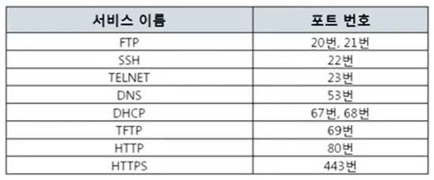

2. registered 포트
   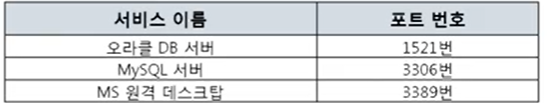

3. dynamic 포트
   일반 사용자들이 이용.  
   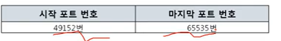

- 내프로그램 (브라우저)와 네이버가 주고받을 때 포트번호  
  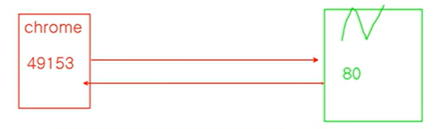

## 프로그램의 연결 정보

### 활성 연결 테이블

현재 포트 활성 여부를 나타낸다.
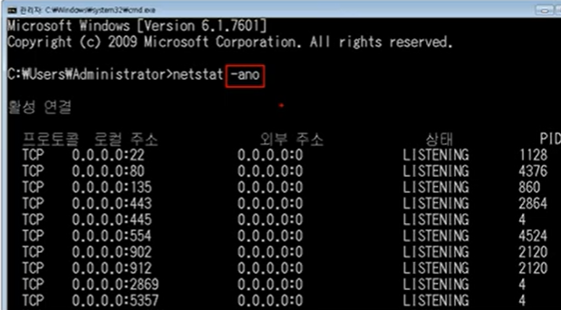

## 실습

1. 현재 연결 상태 확인하기
   netstat -ano 명령어를 이용하여 내 컴퓨터와 현재 연결된 다른 컴퓨터들을 확인해보기

- naver 에 접속했을 때 443번 포트

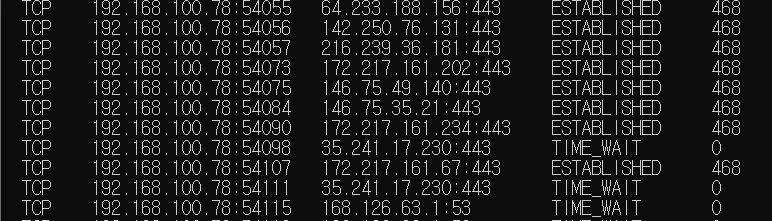

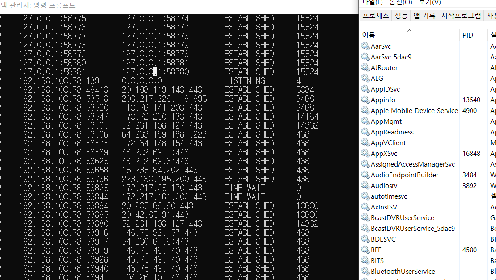

PID를 찾아보면 보통 chrome과 연결되어 있음.

2.  베리즈 웹쉐어 다운로드 받아서 실행

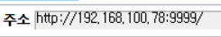

공유할 파일을 올림  
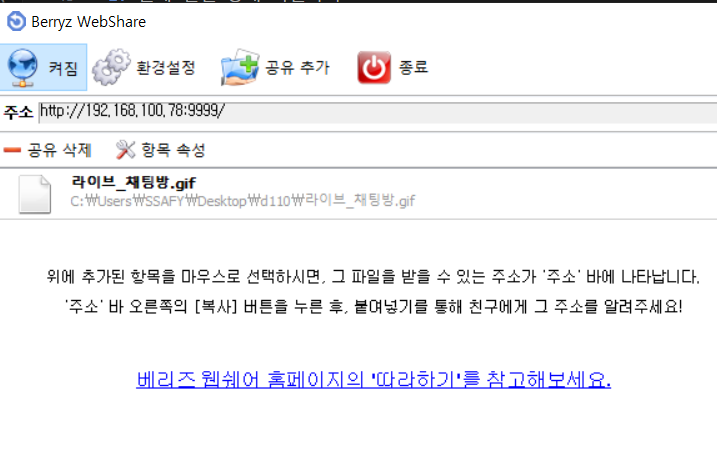

주소창으로 들어가면 파일을 다운로드 받을 수 있음
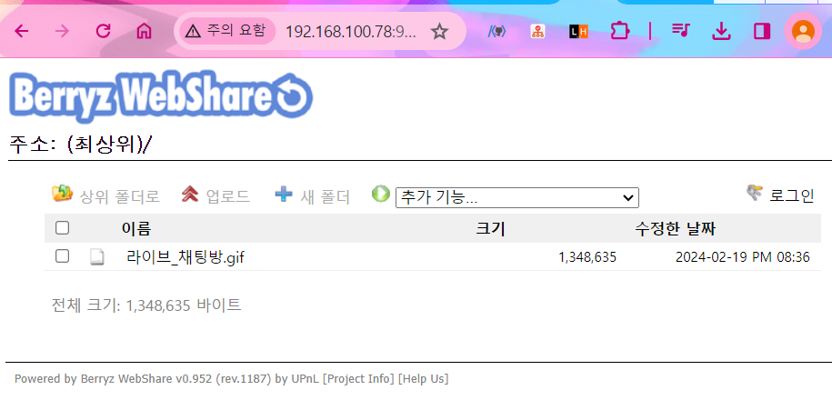

- 네이버 웹서버에는 사실 숨겨진 부분이 있음. .과 443 -> 기본적으로 생략됨.
  

- 9999번 포트번호를 사용하고 있는 프로그램 - webshare
  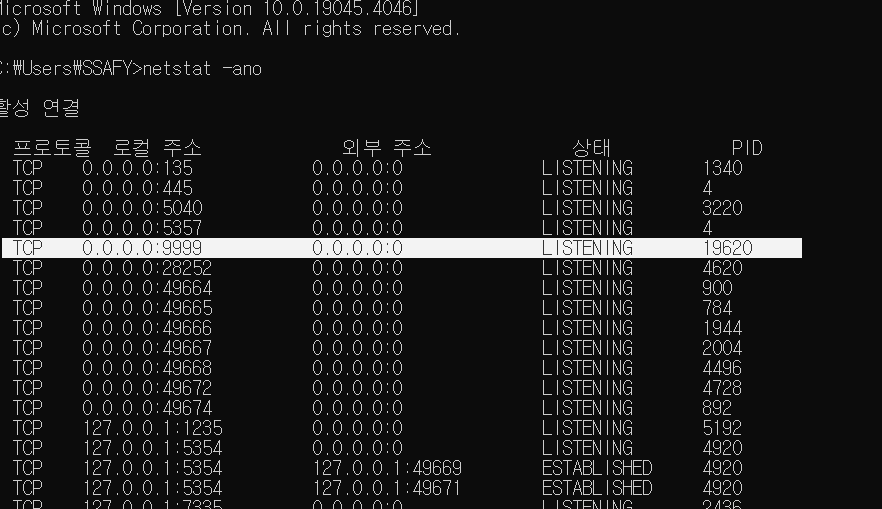
