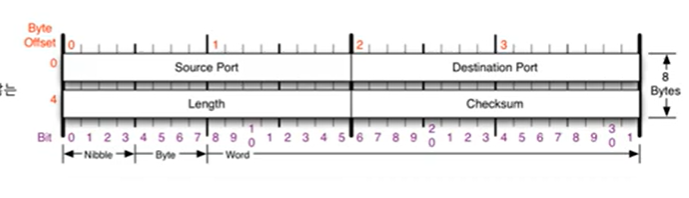
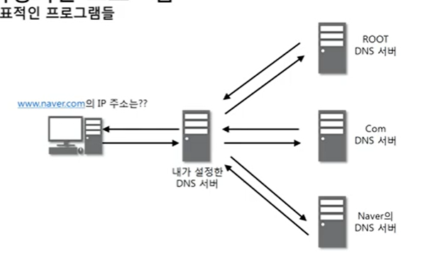
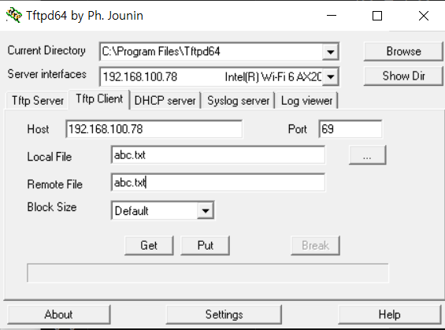
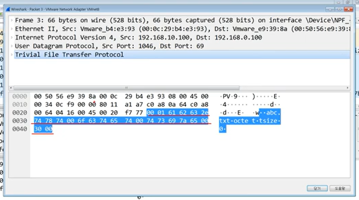

# 8장 UDP 프로토콜

24.03.04  
사용자 데이터그램 프로토콜 User Datagram protocol  
유니버설 데이터그램 프로토콜이라고 일컫기도 한다.

UDP의 전송방식은 너무 단순해서 서비스의 **신뢰성이 낮고**, 데이터그램 도착 순서가 바뀌거나, 중복되거나, 심지어는 통보없이 누락시키기도 한다.

UDP는 일반적으로 오류의 검사와 수정이 필요없는 프로그램에서 수행할 것으로 가정한다.

## 생김새

- 출발지 포트번호, 도착지 포트번호, 길이, 체크섬

- 길이: udp 프로토콜 + 페이로드

## UDP 프로토콜을 사용하는 프로그램

### DNS 서버

도메인을 물으면 IP를 알려줌.

### tftp 서버

UDP로 파일을 전송

### RIP 프로토콜

라우팅 정보를 공유함.

## 실습

1. tftpd를 사용하여 데이터 공유해보기

- tftpd 다운로드  
  
- 저장할 이름, 받을 파일 이름

2. 패킷 캡처 및 분석해보기

-> 파일전송을 UDP로 하면 유실될 우려가 있음. 큰 파일을 전송하지 않음.
-> 동영상 스트리밍할때 udp 사용하면 됨.

- tftpd  
  
