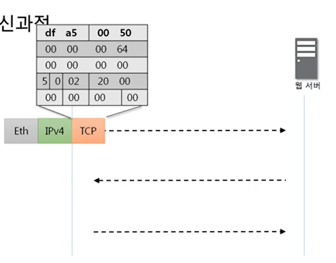
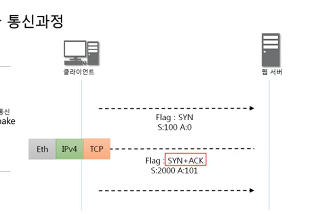
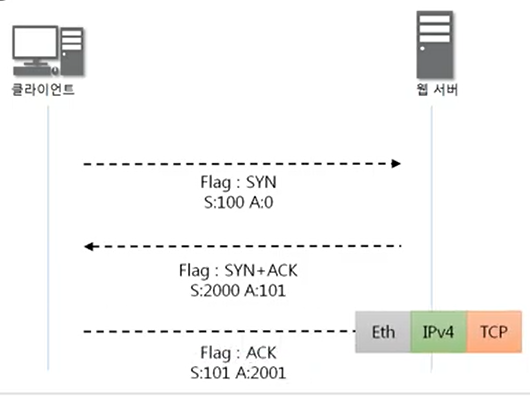

# 9장 TCP 3way handshake

## TCP를 이용한 통시과정

### 연결 수립과정

TCP를 이용한 데이터 통신을 할 때 프로세스와 프로세스를 연결하기 위해 가장 먼저 수행되는 과정

1. 클라이언트가 서버에게 요청 패킷을 보내고
2. 서버가 클라이언트의 요청을 받아들이는 패킷을 보내고
3. 클라이언트는 이를 최종적으로 수락하는 패킷을 보낸다.

위의 3개의 과정을 3way handshake 라고 부른다.

- 보네고  
  
- 받아서 승인 같이 보냄  
  
- 받아서 다시 보냄  
  
