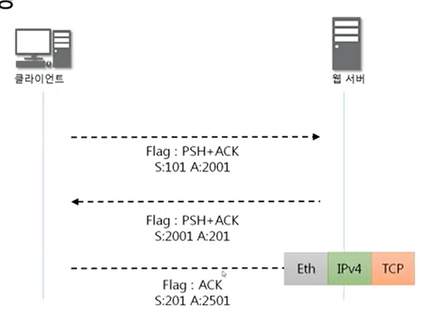

# 9장 TCP 데이터 전송 과정

## 데이터 송수신 과정

-> 연결수립 (3way handshake) 이후에

1. 보낸 쪽에서 또 보낼때는 seq 번호와 ack 번호가 그대로다.
2. 받는 쪽에서 seq 번호는 받은 ack번호가 된다.
3. 받는 쪽에서 ack 번호는 받은 seq 번호 + 데이터의 크기

- 데이터까지 받아옴. ack 번호가 데이터 크기를 반영함
