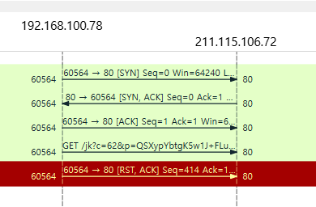

### tcp 분석 실습

- wireshark tcp 들어가서
  

- 가장 위에 있는 세개가 3way handshake임
  

- 플로그래프
  

- 플로그래프 들어가서 필터를 걸면 해당 통신만 볼 수 있음
  

- syn, ack 과정이 나옴
  

- syn에 +1 한 ack로 돌려보내줌
- 받은 ack를 그대로 돌려줌
  

-> 이 3way handshake이 완료되어야 established 됨.

- 받은 ack번호에 데이터 크기를 더해서 syn를 돌려줌

계산을 해야하는 건 아니지만 자세하게 살펴보았음
