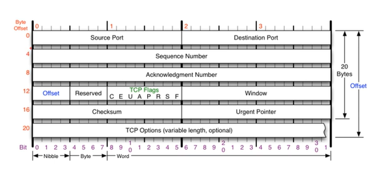
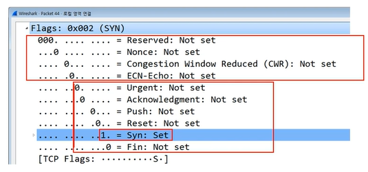

# 9장 연결지향형 TCP 프로토콜

24.03.05

## TCP 프로토콜

전송제어 프로토콜 Transmission control protocol은 인터넷에 연결된 컴퓨터에서 실행되는 프로그램간에 통신을 **안정적으로, 순서대로, 에러없이** 교환할 수 있게 하낟.

TCP는 UDP보다 안전하지만 느리다

## 구조

- 시퀀스 넘버
- acknowledgment number
- 일반적으로 20바이트인데 최대 60까지 늘어날 수 있음
- 오프셋 : 헤더의 길이
- reserved : 예약되어서 사용하지 않음

## TCP 플래그

C E U A P R S F

- u : 1이면 urgent 긴급 비트 urgent pointer랑 같이 사용됨
- a : ack 승인 비트. 응답을 해줄 때 사용
- p : push
- r : 초기화 비트 reset
- s : sync 동기화 비트. 상대방과 연결을 시작할 때 무조건 사용하는 플래그
- f : fin 종료비트. 연결을 끊을 때 사용하는 플래그

