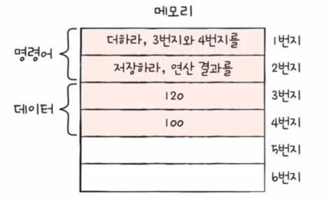

# 컴퓨터 구조를 알아야 하는 이유
- 문제 해결 능력
- 성능, 용량, 비용을 고려한 개발

# 컴퓨터 구조의 큰 그림

## 컴퓨터가 이해하는 정보
### 데이터
- 숫자, 문자, 이미지, 동영상과 같은 정적인 정보
- 컴퓨터와 주고받는/내부에 저장된 정보를 데이터라 통칭하기도 함
- 0과 1로 숫자를 표현하는 방법
- 0과 1로 문자를 표현하는 방법

### 명령어
- 컴퓨터는 결국 명령어를 처리하는 기계
- 명령어
  - 컴퓨터를 실질적으로 움직이는 정보
  - 데이터는 명령어를 위한 일종의 재료
- 명령어의 생김새와 동작 방식

## 컴퓨터의 네 가지 핵심 부품

- 메인보드, 시스템버스, CPU, 메모리, 보조기억장치, 입출력장치

### 1️⃣ 메모리
> 메모리
- 현재 실행되는 프로그램의 명령어와 데이터를 저장하는 부품
- 메인메모리(주기억장치)의 줄임말.
- RAM과 ROM, *강의에서 지칭하는 메모리는 RAM*
- 메모리 정의의 핵심은 **현재 실행되는 프로그램**
  - 프로세스: 현재 실행되는 프로그램
  - 어떤 프로그램이 실행되기 위해서는 그 **프로그램을 이루는 명령어와 데이터**가 메모리 안에 저장되어 있어야 함
- 현재 실행되지 않는 프로그램은 보조기억장치에 저장

> 주소

- 메모리는 주소라는 개념을 갖고 있음
- 주소: 내가 원하는 명령어와 데이터가 지금 메모리 어디에 저장되어 있는지 위치를 특정하기 위해 사용하는 개념(저장위치 알 수 있음)
- 명령어와 데이터 또한 0과 1로 표현돼서 메모리 내에 저장

> 정리
1. 프로그램이 실행되기 위해서는 메모리에 저장되어 있어야 한다.
2. 메모리는 실행되는 프로그램의 명령어와 데이터를 저장한다.
3. 메모리에 저장된 값의 위치는 주소로 알 수 있다.

### 2️⃣ CPU
> CPU
- 메모리에 저장된 명령어를 읽고 해석하고 실행하는 부품(컴퓨터의 두뇌와도 같음)
- 설계가 굉장히 복잡하고 정교함

> CPU 내부 구성 부품
1. **ALU**(산술 논리 연산 장치)
  - 산술연산, 논리연산을 하는 장치. 쉽게말해 계산기
  - 계산을 위한 회로들의 모음
2. **레지스터**
  - CPU 내부의 작은 저장장치. CPU 내에 여러개 있음
3. **제어장치**(컨트롤유닛)
  - 제어 신호를 내보내고, 명령어를 해석하는 장치
  - 제어신호: 컴퓨터 부품들을 관리하고 작동시키기 위한 전기신호
    - CPU가 메모리에 <U>저장된 값을 읽고 싶을 땐</U> 메모리를 향해 **메모리 읽기**라는 제어 신호를 보냄
    - CPU가 메모리에 <U>어떤 값을 저장하고 싶을 땐</U> 메모리를 향해 **메모리 쓰기**라는 제어 신호를 보냄

> ALU, 레지스터, 제어장치를 통해 CPU가 메모리의 명령어를 실행하는 과정

*(간단한 흐름)*

|사진|설명|
|---|---|
||<ul><li>1번지의 명령어를 CPU로 읽어들여야 함</li><li>CPU의 제어장치는 메모리를 향해서 *메모리 읽기* 제어신호를 내보냄</li></ul>|
||<ul><li>메모리는 1번지에 저장된 명령어를 CPU로 가져다줌. 이때 CPU 내부의 작은 저장장치(레지스터)로 가져옴</li><li>제어장치는 레지스터로 읽어들인 명령어를 해석, 판단</li></ul>|
||<ul><li>*메모리 읽기* 신호를 통해 필요한 데이터를 한번 더 가져옴</li><li>3번지, 4번지 또한 레지스터로 가져옴</li><li>제어장치는 해석 후 ALU에 지시</li><li>ALU *(계산기)* 에서 명령어 실행(120+100) 후, 결과를 레지스터에 담음(220)</li></ul>|
||<ul><li>첫번째 명령어 끝, 두번째 명령어 읽어들임</li><li>2번지를 향해 *메모리 읽기* 제어신호 내보냄</li></ul>|
||<ul><li>2번지에 있는 명령어가 레지스터에 저장</li><li>제어장치는 해석, 판단</li></ul>|
||<ul><li>메모리 쓰기 신호와 함께 결과값을 메모리에 저장</li></ul>|

> 정리
- CPU는 메모리에 저장된 값을 읽어들이고, 해석하고, 실행하는 장치
- CPU 내부에는 **ALU, 레지스터, 제어장치**가 있음
  - ALU는 *계산*하는 장치
  - 레지스터는 *임시 저장* 장치
  - 제어장치는 *제어신호*를 발생시키고 *명령어를 해석*하는 장치

### 3️⃣ 보조기억장치
> 보조기억장치
- 보조기억장치는 **전원이 꺼져도 보관될 프로그램을 저장**하는 부품
- USB, SD카드, CD롬, 하드디스크, SSD 등 대용량으로 저장하는, 백업용으로 사용할 수 있는 저장장치

> 메모리와 보조기억장치
- 휘발성 저장장치 → 보조기억장치 필요!
  - 실행 중인 프로그램은 전부 램(메모리)에 저장되어있음
  - 램은 (보조기억장치에 비해) 비싸고, 전원이 꺼지면 저장된 내용을 다 잃어버림
  - 휘발성 저장장치: 전원이 꺼지면 저장된 내용을 다 잃어버리는 특성을 갖는 저장장치
- 전원이 꺼져도 저장된 정보를 보관할 수 있는 저장장치가 필요하게 됨 → **보조기억장치**
- 메모리는 **실행할 정보**를 저장하고 보조기억장치는 **보관할 정보**를 저장한다.
  - 메모리는 실행되고 있는 프로그램의 명령어 데이터를 저장
  - 보조기억장치는 <U>실행되지 않는 프로그램의 명령어와 데이터</U> 저장

### 4️⃣ 입출력장치
> 입출력장치
- 컴퓨터 외부에 연결되어 컴퓨터 내부와 정보를 교환할 수 있는 부품
- 컴퓨터와 정보를 주고받을 수 있는 장치. 컴퓨터 외부에서 컴퓨터로 정보를 주고받을 수 있는 장치
- 입출력장치와 보조기억장치 → 딱 잘라 구분되는 개념은 아님. 주변장치(peripheral device)라 통칭하기도 함.
  - 조금 다른 점은, <U>보조기억장치는 메모리를 보조하는 특별한 입출력장치</U>

### 메인보드(마더보드)
- 컴퓨터의 4가지 핵심부품을 연결할 수 있는 판(핵심 부품 부착)
- 메인보드에 연결된 부품은 버스를 통해 정보를 주고 받음
- **버스**는 컴퓨터의 부품끼리 정보를 주고받는 일종의 통로
- 다양한 종류의 버스가 있고, 컴퓨터의 핵심 부품을 연결하는 버스는 **시스템 버스**
- 메인보드에는 여러 슬롯과 연결단자가 있음. 슬롯에 여러 부품을 연결하면, 연결된 부품이 버스를 타고 서로 정보를 주고 받음

> 시스템 버스

- 내부구성
  - 주소버스: 주소를 주고받는 통로
  - 데이터버스: 명령어와 데이터를 주고받는 통로
  - 제어버스: 제어신호를 주고받는 통로

 

|메모리 값 읽기|메모리 값 쓰기|
|-|-|
|||
|<ul><li>제어버스를 통해 메모리 읽기 신호(제어신호)를 보냄</li><li>주소버스를 통해 읽고 싶은 메모리 주소번지를 전달</li><li>데이터버스를 통해 주소번지에 해당하는 값을 CPU로 전달(레지스터에 저장)</li></ul>|<ul><li>주소버스에 메모리 저장할 주소번지 전달</li><li>제어버스에 메모리 쓰기 신호 전달</li><li>데이터버스에 저장할 데이터 전달</li></ul>|